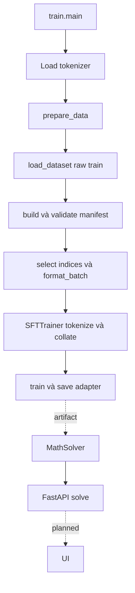

# Math Instruct Llama — Guide

Cập nhật: **2026-10-09**. Tài liệu kỹ thuật mô tả code hiện tại. Roadmap, approvals và lịch sử kiểm chứng nằm trong [PROGRESS.md](PROGRESS.md). [Kế hoạch cũ](IMPLEMENTATION_PLAN.md) được giữ nguyên làm lịch sử.

## 1. Mục tiêu và trạng thái

Fine-tune `unsloth/Llama-3.2-1B-Instruct` trên `TIGER-Lab/MathInstruct`, so sánh Base/LoRA/QLoRA về answer accuracy, validation loss, training time, peak GPU VRAM và trainable parameters. Laptop CPU phục vụ phát triển/kiểm tra; Kaggle T4 dự kiến phục vụ training. API/UI/Docker local là mục tiêu serving; chưa có benchmark hay bằng chứng production-ready.

| Thành phần | Trạng thái và phạm vi bằng chứng |
|---|---|
| Dedup/group split/sampling/manifest | Đã implement và kiểm chứng trong Task 2: report ghi hai real preparations PASS, bảy unit tests PASS; không chứng minh semantic dedup |
| Inspection/tokenizer/collator | Đã implement và kiểm chứng CPU trong Task 1/3A; tiny random model, không forward/training |
| Production completion-only/chat format | Chưa implement; hiện vẫn text-only/full-sequence loss, max length 128 |
| LoRA/QLoRA training, checkpoint reload | Đã implement nhưng chưa kiểm chứng GPU/runtime; adapter cũ có files, provenance/chất lượng chưa xác minh |
| MLflow | Đã implement logging cơ bản; run/artifacts/resource metrics chưa kiểm chứng đầy đủ |
| Evaluation | Có scheduled validation qua Trainer; answer evaluator, base-only baseline và final-test benchmark chưa implement |
| Inference/FastAPI/Docker | Đã implement nhưng chưa kiểm chứng runtime; API readiness còn thiếu |
| UI | Chưa implement; Gradio chỉ có trong requirements |

PASS lịch sử là kết quả Codex báo với commands/artifacts trong PROGRESS; migration tài liệu không chạy lại các thực nghiệm đó.

## 2. Kiến trúc và call chain



Formatting diễn ra trước tokenization: `prepare_data()` trả strings; `SFTTrainer` biến strings thành token IDs và labels. Evaluation sinh đáp án chưa được nối vào pipeline; hiện chỉ có validation loss định kỳ khi training chạy.

### Load và prepare data

Entry point [src/train.py](../src/train.py): `main()` parse `--method` (default `qlora`; choices `lora`, `qlora`, `tinylora`), mở MLflow run, load tokenizer, đặt pad=EOS chỉ nếu thiếu pad, rồi gọi `prepare_data(tokenizer)` **trước khi load model weights**.

Trong [src/data_prep.py](../src/data_prep.py):

| Function | Input → output | Vai trò |
|---|---|---|
| `prepare_data` | Tokenizer → `(train_ds, eval_ds)` | `load_dataset(DATASET_ID)["train"]` → revision → manifest → selected/formatted datasets |
| `cached_revision` | Dataset cache paths → revision | Yêu cầu đúng một thành phần hex 40 ký tự; phụ thuộc cấu trúc cache |
| `normalize_whitespace` | String → normalized string | `" ".join(text.split())`; dùng cho identity, không thay raw training text |
| `canonical_json` / `digest` | Value → stable JSON / SHA256 | Định danh question/pair, raw snapshot và ordering |
| `allocate_quota` | Stratum sizes, total → quotas | Hamilton allocation; integer remainder và lexical tie-breaking |
| `build_manifest` | Raw dataset, revision/settings → dictionary | Dedup question/output, group theo question, test trước rồi validation, sample train |
| `load_or_create_manifest` | Raw/revision/path → manifest | Luôn rebuild expected manifest; create nếu thiếu, compare toàn bộ nếu có; mismatch thì fail, không overwrite |
| `prepared_from_manifest` | Raw/tokenizer/manifest → datasets | Lấy raw index đầu tiên mỗi selected pair; validation lấy primary reference |
| `format_batch` | Batched instruction/output → `{"text": [...]}` | Strip hai đầu, ghép template + EOS; map bỏ các raw columns |

Raw rows cần strings `instruction`, `output`, `source`. Dedup giữ bản đầu tiên của normalized pair, lưu mọi duplicate indices; outputs khác nhau cùng question được giữ trong cùng group. Group split stratify theo source combinations; train sampling theo representative pair source. Selection/order là SHA256(seed, purpose, identity).

Snapshot Task 2: **262.039 raw → 246.002 pairs**, train pool 245.309; `floor(0.03 × 245309)` = **7.359 train**. Validation: **100 primary / 108 all references**; test: **500 groups / 585 all references**. Test chỉ được lưu trong manifest, không được trả cho Trainer. Primary là raw index đại diện nhỏ nhất, không phải lời giải tốt nhất.

[Manifest local](../data/split_manifest.json) chứa identities/indices/hashes, không full texts; Git ignored, khoảng 110,5 MiB. Có manifest vẫn cần raw dataset và vẫn rebuild toàn cấu trúc mỗi lần preparation.

`load_dataset()` không pin revision hoặc bật offline trong production. Cache có thể được tái sử dụng, nhưng không bảo đảm không truy cập mạng. Inspection scripts bật offline; cache thiếu thì fail. Reproducibility/provisioning cần được harden trước controlled runs.

### Format, tokenize và labels

[Config](../src/config.py) dùng plain template:

```text
You are a helpful math tutor.
Solve the problem with clear reasoning and give a concise final answer.

### Question:
{question}

### Answer:
{answer}
```

Formatter append `tokenizer.eos_token`. `_format_one(example)` trong train trả `example["text"]`; Trainer nhận tokenizer qua `processing_class`, tự tokenize/collate.

Production chưa explicit completion-only loss, packing hoặc truncation policy. CPU evidence trên TRL 1.3.0 cho text-only là full-sequence targets, prompt không mask; collator padding labels -100, pad right. `max_length=128` gây answer loss nghiêm trọng. Task 3A thử chat prompt/completion trong script phân tích, **chưa thay production**.

### Train và save

`main()` chọn BF16 nếu CUDA hỗ trợ, còn lại model dtype FP16; training flags BF16/FP16 chỉ bật theo CUDA. LoRA load base 16-bit; QLoRA dùng bitsandbytes NF4, double quantization, rồi `prepare_model_for_kbit_training()`. PEFT `get_peft_model()` gắn LoRA adapters để chỉ học một phần parameters thay vì toàn base.

`SFTTrainer(model, args, train_dataset, eval_dataset, processing_class, formatting_func)` → `trainer.train()` → `trainer.save_model("models/{method}_final")`. Checkpoints nằm tại `models/{method}_checkpoints`. Artifact contents/reload phải xác minh ở smoke task; chưa coi adapter cũ là benchmark result.

MLflow URI `sqlite:///mlruns.db`, experiment `llama-3-math-instruct`, run `{method}_training`; log tay method/LR/epochs/batch, Trainer `report_to="mlflow"`. Chưa log đầy đủ data identity, measurements VRAM/time, effective IDs hoặc final evaluation. Relative paths phụ thuộc working directory.

### Evaluate, inference, API/UI

Validation chạy mỗi 40 optimizer steps qua Trainer khi training hoạt động; không có final `evaluate()` bắt buộc hoặc answer evaluator. Protocol dự kiến trong PROGRESS không phải behavior đã implement.

[src/inference.py](../src/inference.py): CLI tạo `MathSolver(method)` → load base tokenizer/model → `PeftModel.from_pretrained(base, "models/{method}_final")` → Transformers `pipeline("text-generation")`. QLoRA load base 4-bit; các methods khác 16-bit. Không có base-only mode; tokenizer chưa lấy từ adapter artifact.

`solve(question, max_new_tokens=150, temperature=0.7)` → plain template với answer rỗng → `do_sample=True`, `return_full_text=False` → stripped answer string. Đây là demo sampling, chưa phải greedy benchmark protocol.

[app.py](../app.py) import-time load `MathSolver("qlora")`; lỗi load thì solver=None. Pydantic `MathRequest` nhận question/max_new_tokens/temperature; `POST /solve` gọi `solve()` và trả success/question/answer. Model unavailable hoặc generation failure trả 500; exception text có thể được trả trực tiếp. `GET /` luôn trả OK, **không phải readiness**. Chưa có request bounds/concurrency control/lifespan. UI chưa có code.

[Dockerfile](../Dockerfile): Python 3.10 slim, cài requirements rồi cài web packages trùng, copy src/models/app, chạy uvicorn cổng 8000. Build và GPU inference chưa kiểm chứng; adapter/cache/GPU provisioning là prerequisite tương lai.

## 3. Cấu hình thực tế và lý do/phạm vi

| Config | Hiện tại | Ý nghĩa |
|---|---|---|
| Dataset/base | TIGER-Lab/MathInstruct; unsloth/Llama-3.2-1B-Instruct | Dataset toán, base nhỏ cho mục tiêu học PEFT |
| Seed | 42 | Deterministic splits; Trainer seed chưa bảo đảm adapter init vì chưa đặt seed trước init |
| Train fraction | 0,03 sau dedup/split | Giảm quy mô thực nghiệm; chưa phải lựa chọn tối ưu |
| Validation/test | 100/500 question groups | Tách điều chỉnh và benchmark; group split giảm exact-question leakage |
| Max sequence length | 128 | Cấu hình cũ, đã phát hiện không phù hợp; chưa được phép đổi |
| LoRA | r=4, alpha=8, dropout=0,05 | Current candidates, chưa benchmark tối ưu |
| Target modules | q/k/v/o_proj; gate/up/down_proj | Attention và MLP projections |
| Epoch/LR | 1; 2e-4 | Starting config chưa kiểm chứng GPU |
| Microbatch/accumulation | Train/eval 1; accumulation 32 | Một sample mỗi forward; accumulation không tạo padded batch 32 |
| Scheduler/warmup | cosine; 5 steps | Current config, chưa tuning |
| Optimizer | paged_adamw_8bit | Cần xác minh bitsandbytes trên T4 |
| Logging/eval/save | 10/40/40 steps; save_total_limit=1 | Không bảo đảm final validation hoặc best checkpoint selection |

TinyLoRA vẫn trong CLI/import nhưng ngoài phạm vi Base/LoRA/QLoRA comparison. Chỉ sửa nếu chặn scope chính, sau approval.

## 4. Chạy và kiểm chứng

Tất cả commands từ repository root. Env local đã dùng: `/home/nhan/miniconda3/envs/math-instruct-llama/bin/python`; packages hiện diện không chứng minh GPU compatibility. [requirements.txt](../requirements.txt) chưa pin; không tự cài package trong task chưa duyệt.

### CPU regression và analysis

```bash
conda activate math-instruct-llama
python -m unittest discover -s tests -v
python -B -m src.analyze_task3a
```

Unit tests Task 2 từng được Codex báo PASS. Task 3A command từng PASS offline và **ghi lại** [report Task 3A](task3a_analysis_report.json), cần raw/tokenizer cache; script dùng cache paths từ report Task 1. Đây không phải command không có side effects.

`python -m src.inspect_data --verify-labels` và `--check-duplicates` là commands lịch sử; chạy lại sẽ dùng pipeline hiện tại và ghi đè reports Task 1/duplicate audit. `PYTHONPATH=. python tests/verify_real_data.py` cũng ghi đè report Task 2. Không chạy các commands này trong migration tài liệu hoặc khi muốn giữ historical evidence.

### Entry points runtime — chưa xác minh chạy thành công

```bash
python -m src.train --method lora
python -m src.train --method qlora
python -m src.inference --method qlora
uvicorn app:app --host 0.0.0.0 --port 8000
```

Đây là cách gọi theo source, không phải commands đã được migration chạy thử. Training cần môi trường GPU/dependencies/model access được duyệt; inference/API cần adapter đúng method và base cache/access. Runtime có thể download nếu cache thiếu; API start load model ngay. Chưa có command answer evaluation hoặc UI. Docker chỉ có recipe chưa verified, chưa đưa thành quickstart bảo đảm hoạt động.

## 5. Bằng chứng và vấn đề mở

- [Task 1 report](data_inspection_report.json): 7.858 samples **pipeline cũ**, không phải tập train hiện tại.
- [Duplicate audit](data_duplicates_report.json): overlap cũ, trước group split.
- [Task 2 report](data_preparation_report.json): dedup/split/sampling và hai run hashes.
- [Task 3A report](task3a_analysis_report.json): 7.359/100, hai formats, lengths/truncation/actual labels CPU; không đo GPU VRAM/loss.

Chưa giải quyết: completion-only và length policy, dataset/base revisions, cache-path portability, PoT whitespace dedup risk, semantic leakage, evaluator, GPU smoke, MLflow provenance, API readiness, Docker runtime. Các decisions và gates nằm trong PROGRESS. Task 3B chưa được phép triển khai.
