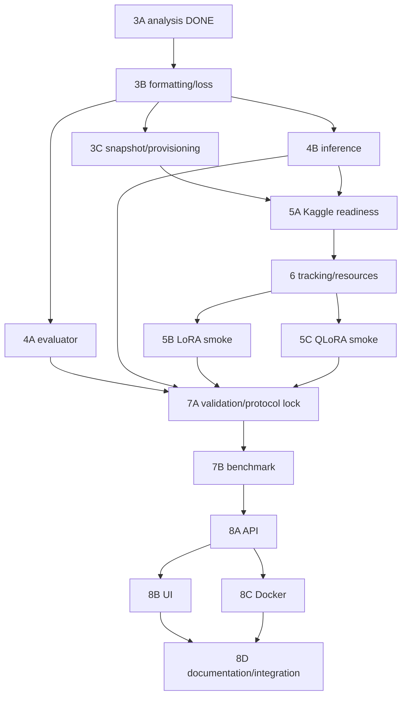

# Math Instruct Llama — Progress

Cập nhật: **2026-10-09**. Nguồn chính cho roadmap, approvals, task status và verification records. Code thực tế được giải thích trong [GUIDE.md](GUIDE.md). [IMPLEMENTATION_PLAN.md](IMPLEMENTATION_PLAN.md) giữ nguyên lịch sử trước migration, không tiếp tục cập nhật.

## 1. Quy trình bắt buộc

**PLAN → USER APPROVAL → IMPLEMENT → TEST → CLEANUP → UPDATE GUIDE/PROGRESS → USER REVIEW.**

Trước code: giải thích vấn đề/giải pháp, chính xác files/functions, acceptance và kiểm chứng; chờ approval. Sau implementation: giải thích diff, tests/results, dọn công cụ đã hết vai trò, cập nhật hai tài liệu, dừng review. Không tự chuyển task. DONE chỉ khi acceptance của task đạt; PASS một test không đồng nghĩa runtime toàn hệ thống verified hoặc decision được duyệt.

Chỉ giữ runtime code và regression tests dài hạn. Inspection/debug/profiling scripts là tạm: reuse trước khi tạo, giữ đến khi fix được duyệt và tests PASS, rồi đánh giá cleanup. Không xóa evidence/report/tests quan trọng trước khi giải thích tác động. Không thêm modules/abstractions nếu code hiện tại xử lý rõ ràng được.

Mỗi task record ghi ngày, approval/scope, files/functions, commands/environment, actual results, acceptance/limits, cleanup, unresolved issues và next action. CPU simulation, actual collator, GPU runtime và measurements phải phân biệt.

## 2. Task hiện tại và approval gates

**Task hiện tại: migration tài liệu**, chỉ GUIDE/PROGRESS/README và historical notice. Implementation và documentation checks hoàn tất theo record cuối file, đang chờ user review. Không training, cleanup scripts hoặc Task 3B.

| Nội dung | Approval/status |
|---|---|
| Roadmap tổng thể Base/LoRA/QLoRA đến deployment | User APPROVED; không cấp phép tự triển khai mọi task |
| Task 3A: offline analysis trên train/validation | User APPROVED và đã thực hiện |
| Quy trình hai tài liệu và migration tài liệu | User APPROVED, scope bốn Markdown files |
| Chat prompt-completion / explicit masking | Proposal sau 3A, **chờ review và approval triển khai** |
| Max length 1024/2048 | Candidates để GPU thử, **chưa chốt**; production vẫn 128 |
| Reject/quarantine samples quá dài | Proposal, **chưa duyệt**; manifest/effective selections chưa đổi |
| Task 3B / scripts cleanup / GPU runs | **Chưa được phép thực hiện** |

Quyết định lịch sử được ghi trong kế hoạch cũ: seed 42, dedup trước group split, validation 100/test 500 groups, 3% train records sau split; primary/all references riêng; JSON reports; dùng real cached MathInstruct; CPU local/GPU Kaggle; TinyLoRA ngoài comparison; MLflow/FastAPI/Docker local, không registry/Kubernetes/public deployment. Đây là baseline hiện có, không biến các đề xuất Task 3A thành approval.

## 3. Tracker

TODO = chưa thực hiện; IN PROGRESS = còn acceptance chưa đạt; BLOCKED = có blocker kèm evidence/hướng giải quyết; DONE = đạt acceptance trong phạm vi ghi rõ. Kết quả lịch sử dưới đây do Codex báo, có artifacts/commands; migration không chạy lại model/data tests.

| Task | Status | Evidence/remaining gate |
|---|---|---|
| 1 — Inspection | DONE | Real-data statistics pipeline cũ + actual collator trên ba samples; không forward |
| 2 — Dedup/group split/manifest | DONE | Bảy unit tests và hai preparations reported PASS; exact-normalized-question overlap 0 |
| 3A — Length/truncation/masking analysis | DONE | 7.359 train/100 primary validation; 300 actual-label cases PASS; không GPU |
| 3 — Formatting/loss tổng thể | IN PROGRESS | 3A hoàn tất; 3B chưa được phép implement; length cuối chưa chốt |
| 3B — Production formatting/loss | TODO | Chờ review 3A và approval riêng |
| 3C — Snapshot/provisioning | TODO | Chưa pin revisions/provisioning |
| 4A — Evaluator | TODO | Chưa có answer evaluator |
| 4B — Shared inference | TODO | Base-only/greedy/artifact tokenizer chưa có |
| 5A — Kaggle readiness | TODO | Installed packages không chứng minh GPU compatibility |
| 6 — Tracking/resources | TODO | Logging cơ bản có, acceptance đầy đủ chưa đạt |
| 5B — LoRA smoke | TODO | Chưa optimizer steps/save-reload verified |
| 5C — QLoRA smoke | TODO | Chưa quantized optimizer/runtime verified |
| 7A — Validation/protocol lock | TODO | Chưa baseline/pilot/locked config |
| 7B — Controlled benchmark | TODO | Chưa actual benchmark results |
| 8A — API hardening | TODO | API có code, lifecycle/readiness/tests chưa đạt |
| 8B — UI | TODO | Chưa có UI source |
| 8C — Docker verification | TODO | Recipe có, build/GPU runtime chưa verified |
| 8D — Documentation/end-to-end | TODO | GUIDE/PROGRESS hiện có; clean setup/runtime walkthrough chưa đạt |
| Migration tài liệu | DONE | Bốn Markdown files; links/paths, integrity và diff checks PASS; chờ user review |

## 4. Kết quả và bằng chứng đã giữ

### Task 1 — inspection pipeline cũ

- **Files/functions từng sửa:** `src/inspect_data.py` (`recover_metadata`, `inspect_samples`, `verify_actual_labels`, `main`); inspection từng nằm trong data_prep rồi được tách ra. Formatter/train/config được giữ nguyên trong real inspection. Các vòng synthetic/JSON migration được giữ đầy đủ trong lịch sử, không xóa.
- **Commands lịch sử:** `python -m src.inspect_data` offline; Conda project `python -m src.inspect_data --verify-labels`; report assertions, AST/SHA256 comparisons, `git diff --check`.
- **Statistics:** 7.858 train samples trước Task 2; min/median/p90/p95/p99/max 58/192/467/656,15/1.018,86/2.012. Vượt 128: 7.040 (89,59%); 256: 2.105; 512: 649. Tại 128: 7.005 answer truncated, 1.107 mất toàn answer, 7.040 mất EOS.
- **Actual labels reported PASS:** TRL 1.3.0, Transformers 5.7.0, Torch 2.11.0, PEFT 0.19.1, Accelerate 1.13.0; ba samples CPU với tiny random model. Prompt unmasked, real labels bằng IDs, padding -100 bên phải; có sample chỉ còn prompt targets. Không numerical loss/forward/training.
- **Acceptance/limits:** Task 1 DONE trong phạm vi inspection/preprocessing/collator; số liệu không đại diện train mới. Nhận định thiếu TRL ban đầu áp dụng Python mặc định, đã giải quyết bằng env sẵn có, không cài thêm.
- **Evidence:** [data_inspection_report.json](data_inspection_report.json), các Task 1 records trong [lịch sử](IMPLEMENTATION_PLAN.md). Không chạy lại script để ghi đè evidence cũ.

### Task 2 — duplicate audit rồi deterministic preparation

- **Audit trước fix:** 262.039 raw, 224.460 questions, 246.002 pairs; 12.202 duplicate pair groups, 16.037 surplus records, 8.993 questions có distinct outputs. Pipeline cũ train/validation có 5 shared questions. [Audit report](data_duplicates_report.json) là bằng chứng trước group split.
- **Files/functions từng sửa:** config (test size/manifest path); data_prep (`normalize_whitespace`, `allocate_quota`, `build_manifest`, `load_or_create_manifest`, `cached_revision`, `prepared_from_manifest`, `prepare_data`, hash helpers); tests và report. `format_batch` giữ nguyên theo AST comparison đã báo.
- **Implemented policy:** whitespace-only pair identity, representative index nhỏ nhất; distinct outputs giữ cùng question group; Hamilton quotas trên 13 source-combination strata, test trước validation; SHA256 ordering; 3% sampling theo representative source.
- **Actual counts:** 246.002 distinct pairs sau bỏ 16.037 duplicates; train pool 245.309 records/223.860 groups; selected train 7.359; validation 100 groups/108 all refs/100 primary; test 500 groups/585 all refs. Selected train CoT/PoT 5.181/2.178; validation primary 69/31; test primary 346/154.
- **Commands:** Conda project `python -m unittest discover -s tests -v`; offline `PYTHONPATH=. python tests/verify_real_data.py` (harness từ /tmp khi kiểm chứng); formatter AST/source hashes; `git diff --check`.
- **Reported PASS:** bảy unit cases; hai complete real preparations có cùng manifest bytes/hash, ordered subset, train/validation text hashes và test-reference hashes; snapshot/settings mismatch fail; zero normalized-question overlap; text-only schema compatible. Harness đầu fail do datasets.Column không JSON serializable, sửa thành list rồi rerun PASS.
- **Provenance:** revision `b4fdc323a7be1379c9c7c0b67b1de72dfee2111a`; snapshot hash `6b438786f5ef69c39ac752b4d6eb7ccbfbfd69787ea61047f4a30702a475cc1a`; manifest file SHA256 `b83ac64a3ea90090a11b12febba9d645bd2e7c1406eabd282bfa70ca90411647`, 115.897.944 bytes. [Report](data_preparation_report.json); [local manifest](../data/split_manifest.json), Git ignored.
- **Acceptance/limits:** DONE theo exact normalized equality/determinism; không semantic leakage proof, không đánh giá correctness references. Full rebuild CPU/RAM, PoT indentation normalization và source representative còn mở; không GPU training.

### Task 3A — analysis sau Task 2

- **Approval:** user chỉ cho analysis, không production changes/training/test tuning. Task 3A DONE không cấp approval cho proposal.
- **Files/functions:** thêm [analyze_task3a.py](../src/analyze_task3a.py): `representation`, `stats`, `summarize`, `verify`, `main`; generated [task3a_analysis_report.json](task3a_analysis_report.json); cập nhật tracker cũ.
- **Command đã PASS:** `PYTHONDONTWRITEBYTECODE=1 /home/nhan/miniconda3/envs/math-instruct-llama/bin/python -B -m src.analyze_task3a > /tmp/task3a-analysis.log 2>&1`. Offline CPU, tokenizer local-only; Arrow paths lấy từ report Task 1, toàn snapshot hashes đối chiếu manifest.
- **Scope:** đúng 7.359/100 ordered selections, không test metrics; current vs chat template, fixed date `09 Oct 2026`; prompt/answer/total min/median/p90/p95/p99/max và CoT/PoT riêng; năm lengths 128/256/512/1024/2048.
- **Current train total:** median/p95/p99/max 192/632/939,84/2.126; chat 219/659,10/967,42/2.154. Chat validation max 926; current 898. Answer lengths không đổi giữa hai formats.
- **Keep-start truncation:** current train truncated 6.596/1.955/599/43/1, answer lost 1.004/103/6/0/0; chat truncated 7.167/2.458/658/49/1, answer lost 3.006/138/8/0/0. Partial/stop-only losses và rates chi tiết trong JSON. Chat validation truncated 99/33/10/0/0, answer lost 40/1/0/0/0.
- **Actual labels reported PASS:** hai formats, mỗi format chín real train/sáu validation examples, năm lengths × keep_start/keep_end = 300 cases. Full preprocessing IDs, chat completion mask, prompt/padding -100, answer/EOT eligibility, microbatch-one consistency được kiểm tra tensor. TRL thực sự reject formatting_func + completion_only_loss=True. Template không generation-mask blocks. Không model forward/training.
- **Additional checks PASS:** report category/partition/volume assertions, prefix equality toàn selected records, AST, production SHA256, manifest bytes unchanged, diff check. Lượt đầu analysis assertion fail do chưa lấy rõ apply_chat_template input_ids; sửa script/rerun PASS. BOS zero-offset được tính vào prompt.
- **CPU token-volume arithmetic:** chat full 2.029.922 tokens; capped volumes 939.477/1.574.131/1.885.891/2.021.502/2.029.816. Dynamic microbatch 1 padding 0; batch 4/8 theo manifest order, fixed-max padding là giả định riêng. Không VRAM/speed measurement.
- **Proposal chờ review:** chat prompt/completion, completion_only_loss=True, shared formatter/date policy; thử 1024/2048 T4; quarantine overlength IDs thay vì cắt final answer/code. Complete training records 7.310/7.358; cả hai giữ 100 validation. Production vẫn plain text/128, selections chưa lọc.
- **Limits:** all-record statistics là tokenizer arithmetic; actual labels chỉ representative examples; environment/cache portability/GPU feasibility chưa verified. Reports/manifests/tests cũ giữ nguyên.

## 5. Roadmap và dependencies đã duyệt ở mức kế hoạch

Đây là dependencies, không phải triển khai đồng thời. Mỗi task bên dưới cần plan/approval riêng; paths mới là dự kiến, không link tới files chưa tồn tại. Tracking trước smoke để smoke cũng xác minh measurements.

| Task / mục tiêu | Prerequisites; files/components; công nghệ | Steps và deliverables | Acceptance và tests; môi trường | Rủi ro / ngoài scope |
|---|---|---|---|---|
| 3B — đúng objective/format | Review 3A; data_prep/config/train/inference, tests; TRL/tokenizer | Shared format → schema → explicit mask/length policy → effective IDs report | Actual prompt/pad -100; answer/EOT targets; format parity; boundary/empty/overlength tests; CPU | Exclusion thay coverage; không GPU optimization/split changes |
| 3C — reproducible provisioning | Task 2/3B; config/data_prep/tests; HF revisions/hashes | Pin dataset/base/tokenizer → verify identities → artifact transfer instructions | Wrong snapshot fail; selections không đổi; loader/revision/hash tests; CPU | Cache/permissions; không tối ưu manifest hoặc đổi dedup |
| 4A — answer accuracy | References + approved scoring policy; proposed evaluate.py/tests; Decimal/Fraction/JSONL | Parse refs → lock eligibility → parse predictions → per-group multi-ref score | Denominator/coverage/failures đúng; fraction/choice/ambiguous/conflict fixtures; CPU | Ref noise/PoT; không execute code, symbolic generality hay LLM judge |
| 4B — shared inference | 3B; inference/config/tests; Transformers/PEFT/bnb | Base-only → configurable precision/adapter → artifact tokenizer → greedy/demo modes | Mocks loader/format parity/stop config; actual GPU check ở smoke | Tokenizer mismatch; không API/merge/acceleration |
| 5A — GPU readiness | 3B/3C/4B + provisioning approval; requirements/config; CUDA stack | Inventory GPU/versions → imports → FP16/base/4bit load → inference | Compatible imports/device/dtype/kernels; CLI/load checks; T4 | Local versions không bảo đảm Kaggle; chưa optimizer training |
| 6 — provenance/resources | 5A, effective config; train/config, minimal tracking code; MLflow/CUDA timer | Log identities → measurements → final eval → export DB/artifacts | Correct active run; metrics/artifact round-trip; CPU mocks rồi GPU smoke | Artifact paths/session loss; không server/registry |
| 5B — LoRA smoke | 5A/6; train/config/checks; PEFT/TRL | Seed trước init → fixed tiny train IDs → hai optimizer steps → save/reload/generate | Finite loss/grad/update, frozen base, reload tolerance; T4 | Không mọi matrix có nonzero grad ngay step 1; không full training/quality claim |
| 5C — QLoRA smoke | 5A/6; train/config/checks; NF4/kbit/bnb optimizer | Verify quantization → hai optimizer steps → same-config reload/generate | Grad/update/frozen base/4bit/VRAM evidence; T4 | Kernel compatibility; không full run/merge |
| 7A — validation/protocol lock | Evaluator/inference và hai smoke PASS; config/protocol | Base validation → small pilots nếu cần → approve length/LR/checkpointing/generation | Same validation IDs/masks, eligibility independent predictions; hash/finite-loss tests; T4 | 100 groups nhỏ; không test tuning/search rộng |
| 7B — controlled benchmark | Locked 7A + run approval; train/evaluate/reports | LoRA/QLoRA → same checkpoint rule → lock artifacts → final test → 20 lỗi | Same IDs/hardware/protocol; five metrics traceable, completeness/reload checks; T4 | Một seed/reference noise/pretraining contamination; không claim optimal |
| 8A — API reliability | Verified inference/artifact; app/inference/tests; FastAPI/Pydantic | Lifespan/config → readiness → bounds → serialized generation/errors | 422 invalid, 503 unavailable, sanitized failures; mocks + real GPU API smoke | Workers/concurrency; không public scaling/auth |
| 8B — demo UI | 8A; proposed ui.py; Gradio/HTTP | API client → inputs/status/errors → launch command | Không load model thứ hai; mocked HTTP + manual smoke; CPU | Timeouts; không public hosting/complex switcher |
| 8C — container runtime | 8A + compatible versions; Docker/requirements | Remove duplicate installs → artifacts/cache mounts → build/run | Clean build/readiness/solve/restart; Docker GPU host | Kaggle không bảo đảm Docker daemon; CPU serving là decision riêng; không orchestration |
| 8D — reproducible documentation | Verified components; README/GUIDE/PROGRESS | Setup/commands/artifacts/results/limits → clean walkthrough | Tested commands, paths, honest claims; CPU + serving host | Docs/runtime drift; không portfolio website |

## 6. Priorities và protocol

**MUST trước mốc tương ứng:** masking/truncation và train/inference parity trước training; immutable identities/seed trước controlled runs; evaluator/multiple-ref policy trước quality comparison; GPU compatibility trước full run; final eval/provenance/measurements trước benchmark; API readiness/bounds và container verification trước deployment complete.

**SHOULD:** đo rebuild manifest CPU/RAM trước tối ưu; explicit revision thay cache-path inference; audit PoT indentation dedup trước đổi normalization; document representative source. **OPTIONAL:** semantic duplicate audit, packing/FlashAttention/multi-GPU, base NF4 đối chứng. TinyLoRA import chỉ MUST nếu chặn LoRA/QLoRA. Không registry/Kubernetes/public deployment.

Protocol kế hoạch giữ seed 42 và cùng raw snapshot/splits/formatter/tokenizer/mask/hardware; validation điều chỉnh, test chỉ final benchmark sau khóa cấu hình. Numeric/fraction/finite-decimal/multiple-choice evaluator v1, reference unsupported/conflict policy chờ duyệt, prediction parse fail tính sai; nhiều refs tính một question một lần. Công bố coverage/eligible IDs/truncation.

Current hyperparameters (rank4/alpha8/dropout0,05, LR2e-4, microbatch1/accum32, một epoch) chỉ starting candidates; không khẳng định tối ưu. Greedy generation/max_new_tokens512 là baseline kế hoạch cũ, phải khóa lại sau pilot, **không runtime hiện tại**. Validation loss cùng masks/IDs và final evaluation bắt buộc trong implementation tương lai.

Training time kế hoạch: trước train đến sau final save, CUDA synchronized; preparation đo riêng. Peak allocated/reserved cùng phạm vi, GPU identity ghi rõ. Base trainable=0; training time/training VRAM N/A; inference resource metrics tách riêng. QLoRA NF4 comparison chứa quantization confound; base NF4 tùy khả thi. Không có actual benchmark results.

## 7. Cleanup inventory và việc tiếp theo

| Component | Policy sau audit | Gate |
|---|---|---|
| Runtime source/config/API/Docker/requirements | KEEP | Thay đổi theo task approved |
| tests/test_data_prep.py | KEEP | Giữ dedup/leakage/integrity tests; schema assertions thay có chủ đích ở 3B |
| src/analyze_task3a.py | TEMPORARY | Reuse 3B; chuyển checks quan trọng sang tests trước khi đề xuất xóa |
| src/inspect_data.py | REMOVE CANDIDATE | Rà functionality độc nhất, evidence và replacements trước cleanup |
| tests/verify_real_data.py | TEMPORARY | Rút long-term integration checks, không ghi đè reports; chưa được phép sửa |
| Four JSON reports + manifest | KEEP evidence/artifact | Không xóa; labels lịch sử Task 1/duplicate audit rõ |

Khi xóa scripts sẽ mất entry point tái tạo reports tương ứng; phải ghi tác động và giữ regression/evidence trước approval cleanup. Migration này không cleanup.

**Task tiếp theo:** user review migration tài liệu và kết quả Task 3A. Sau đó mới lập/duyệt plan Task 3B với files/functions, acceptance và tests cụ thể. Chưa implementation 3B, chưa chọn max length/truncation policy, chưa GPU runs.

## 8. Migration record — 2026-10-09

- **Approval/scope:** user APPROVED tạo GUIDE/PROGRESS, cập nhật README, thêm historical notice vào kế hoạch cũ; không code/tests/scripts/reports/manifest changes.
- **Files changed:** bốn Markdown files trên; không function sửa, không file xóa, không module/tài liệu khác được tạo.
- **Content:** GUIDE trace source/config/calls/I/O/runtime gaps; PROGRESS lịch sử Task1/2/3A, roadmap, approval gates và cleanup inventory; README entry point ngắn; toàn nội dung kế hoạch cũ giữ nguyên sau notice.
- **Verification commands:** read-only source/docs audit; Python local-link/path checks và SHA256 comparisons với `/tmp/doc-migration-before.json`; exact historical suffix comparison; `git diff --check`; whitespace checks cho cả new/untracked Markdown files.
- **Actual results:** links/paths tồn tại; lịch sử kế hoạch cũ byte-for-byte unchanged sau notice; chỉ README/kế hoạch cũ đổi trong preexisting files, chỉ GUIDE/PROGRESS mới; source/scripts/tests/reports/manifest hashes unchanged; diff/whitespace checks PASS. Không rerun data/model tests, tải weights hoặc training.
- **Acceptance:** migration DONE trong phạm vi tài liệu; đang chờ user review. Không đánh dấu deployment hoặc Task 3B DONE.
