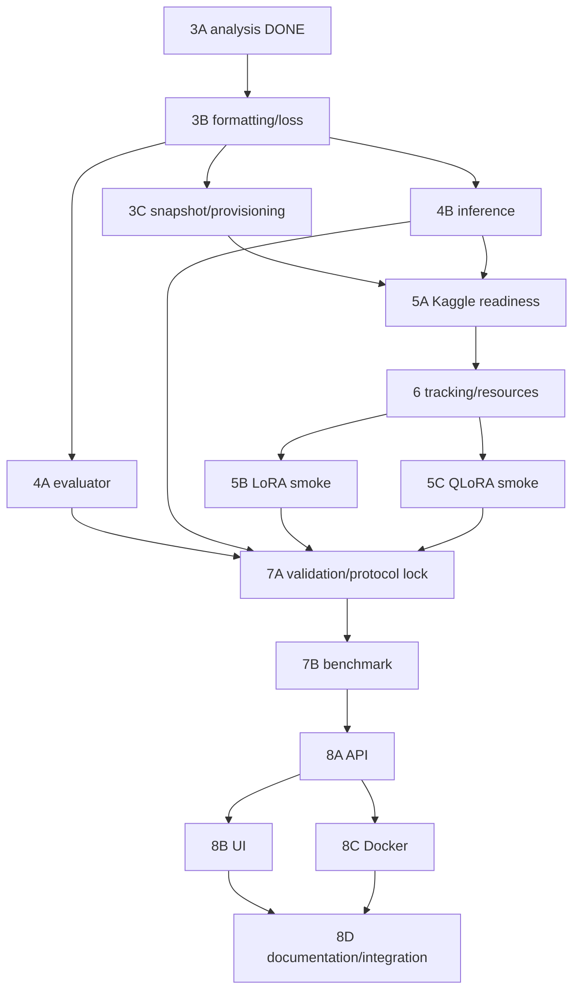

# Math Instruct Llama — Progress

Cập nhật: **2026-10-10**. **Session mới đọc section 17 và section 15 trước để lấy trạng thái mới nhất; sections 4–14 là lịch sử theo thời điểm.** Nguồn chính cho roadmap, approvals, task status và verification records. Code thực tế được giải thích trong [GUIDE.md](GUIDE.md). [IMPLEMENTATION_PLAN.md](IMPLEMENTATION_PLAN.md) giữ nguyên lịch sử trước migration, không tiếp tục cập nhật.

## 1. Quy trình bắt buộc

**PLAN → USER APPROVAL → IMPLEMENT → TEST → CLEANUP → UPDATE GUIDE/PROGRESS → USER REVIEW.**

Trước code: giải thích vấn đề/giải pháp, chính xác files/functions, acceptance và kiểm chứng; chờ approval. Sau implementation: giải thích diff, tests/results, dọn công cụ đã hết vai trò, cập nhật hai tài liệu, dừng review. Không tự chuyển task. DONE chỉ khi acceptance của task đạt; PASS một test không đồng nghĩa runtime toàn hệ thống verified hoặc decision được duyệt.

Chỉ giữ runtime code và regression tests dài hạn. Inspection/debug/profiling scripts là tạm: reuse trước khi tạo, giữ đến khi fix được duyệt và tests PASS, rồi đánh giá cleanup. Không xóa evidence/report/tests quan trọng trước khi giải thích tác động. Không thêm modules/abstractions nếu code hiện tại xử lý rõ ràng được.

Mỗi task record ghi ngày, approval/scope, files/functions, commands/environment, actual results, acceptance/limits, cleanup, unresolved issues và next action. CPU simulation, actual collator, GPU runtime và measurements phải phân biệt.

## 2. Task hiện tại và approval gates

**Task hiện tại: hoàn tất documentation handoff sau user-run Kaggle GPU smoke.** Implementation/cleanup đã hoàn tất; source fixes đã commit/push theo approval sau đó. Kết quả mới nhất ở section 15. User đã chạy GPU smoke, không có local GPU training do agent thực hiện. Không tự chạy full training hoặc deployment; không mở lại audit/kế hoạch hoặc dependency work đã bị user dừng.

| Nội dung | Approval/status |
|---|---|
| Roadmap tổng thể Base/LoRA/QLoRA đến deployment | User APPROVED; không cấp phép tự triển khai mọi task |
| Task 3A: offline analysis trên train/validation | User APPROVED và đã thực hiện |
| Quy trình hai tài liệu và migration tài liệu | User APPROVED, scope bốn Markdown files |
| Chat prompt-completion / explicit masking | User APPROVED Task 3B; implemented, CPU IDs/labels PASS |
| Max length 1024/2048 | 1024 được APPROVED cho implementation/pilot; 2048 candidate, benchmark config chưa khóa |
| Reject/quarantine samples quá dài | APPROVED exclude train/fail validation; effective subset riêng, manifest không đổi |
| Implementation/cleanup | User APPROVED BLOCKER/REQUIRED và cleanup hai scripts/bốn reports sau PASS; GPU smoke đã được user thực hiện, full training chưa được duyệt |

Quyết định lịch sử được ghi trong kế hoạch cũ: seed 42, dedup trước group split, validation 100/test 500 groups, 3% train records sau split; primary/all references riêng; JSON reports; dùng real cached MathInstruct; CPU local/GPU Kaggle; TinyLoRA ngoài comparison; MLflow/FastAPI/Docker local, không registry/Kubernetes/public deployment. Đây là baseline hiện có, không biến các đề xuất Task 3A thành approval.

## 3. Tracker

TODO = chưa thực hiện; IN PROGRESS = còn acceptance chưa đạt; BLOCKED = có blocker kèm evidence/hướng giải quyết; DONE = đạt acceptance trong phạm vi ghi rõ. Kết quả lịch sử dưới đây do Codex báo, có artifacts/commands; migration không chạy lại model/data tests.

| Task | Status | Evidence/remaining gate |
|---|---|---|
| 1 — Inspection | DONE | Real-data statistics pipeline cũ + actual collator trên ba samples; không forward |
| 2 — Dedup/group split/manifest | DONE | Bảy unit tests và hai preparations reported PASS; exact-normalized-question overlap 0 |
| 3A — Length/truncation/masking analysis | DONE | 7.359 train/100 primary validation; 300 actual-label cases PASS; không GPU |
| 3 — Formatting/loss tổng thể | IN PROGRESS | CPU checks và hai GPU runtime smokes PASS; quality evaluation/protocol lock còn mở |
| 3B — Production formatting/loss | DONE (CPU scope) | Current integration7410 samples PASS, invariants preserved, cleanup/docs completed; không GPU proof |
| 3C — Snapshot/provisioning | DONE (CPU scope) | Immutable pins/content checks, CPU integration và Kaggle fresh dataset load PASS; clean environment còn mở |
| 4A — Evaluator | TODO | Chưa có answer evaluator |
| 4B — Shared inference | IN PROGRESS | Real QLoRA905/LoRA73d reload + greedy demo PASS; latest LoRA607 reload, numerical tolerance và base-only còn mở |
| 5A — Kaggle readiness | IN PROGRESS | T4/FP16 stack chạy cả hai smoke PASS; torchao workaround và global pip conflicts, chưa clean setup proof |
| 6 — Tracking/resources | IN PROGRESS | CPU round-trip PASS; GPU logging/save flow hoàn tất, chưa inspect downloaded MLflow metrics/VRAM |
| 5B — LoRA smoke | IN PROGRESS | Latest905 train2/2 + validation100/100 + save PASS; old73d reload PASS, latest607 reload còn mở |
| 5C — QLoRA smoke | IN PROGRESS | 905 GPU train2/2 + validation100/100 + save/reload/greedy PASS; numerical tolerance/resource evidence còn mở |
| 7A — Validation/protocol lock | TODO | Chưa baseline/pilot/locked config |
| 7B — Controlled benchmark | TODO | Chưa actual benchmark results |
| 8A — API hardening | IN PROGRESS | Lifespan/readiness/bounds/safe errors/lock implemented; GPU serving chưa verified |
| 8B — UI | TODO | Chưa có UI source |
| 8C — Docker verification | IN PROGRESS | Mount-based recipe, duplicate install removed; build/runtime/image selection chưa verified |
| 8D — Documentation/end-to-end | TODO | GUIDE/PROGRESS hiện có; clean setup/runtime walkthrough chưa đạt |
| Migration tài liệu | DONE | Bốn Markdown files; links/paths, integrity và diff checks PASS; chờ user review |

## 4. Kết quả và bằng chứng đã giữ

### Task 1 — inspection pipeline cũ

- **Files/functions từng sửa:** `src/inspect_data.py` (`recover_metadata`, `inspect_samples`, `verify_actual_labels`, `main`); inspection từng nằm trong data_prep rồi được tách ra. Formatter/train/config được giữ nguyên trong real inspection. Các vòng synthetic/JSON migration được giữ đầy đủ trong lịch sử, không xóa.
- **Commands lịch sử:** `python -m src.inspect_data` offline; Conda project `python -m src.inspect_data --verify-labels`; report assertions, AST/SHA256 comparisons, `git diff --check`.
- **Statistics:** 7.858 train samples trước Task 2; min/median/p90/p95/p99/max 58/192/467/656,15/1.018,86/2.012. Vượt 128: 7.040 (89,59%); 256: 2.105; 512: 649. Tại 128: 7.005 answer truncated, 1.107 mất toàn answer, 7.040 mất EOS.
- **Actual labels reported PASS:** TRL 1.3.0, Transformers 5.7.0, Torch 2.11.0, PEFT 0.19.1, Accelerate 1.13.0; ba samples CPU với tiny random model. Prompt unmasked, real labels bằng IDs, padding -100 bên phải; có sample chỉ còn prompt targets. Không numerical loss/forward/training.
- **Acceptance/limits:** Task 1 DONE trong phạm vi inspection/preprocessing/collator; số liệu không đại diện train mới. Nhận định thiếu TRL ban đầu áp dụng Python mặc định, đã giải quyết bằng env sẵn có, không cài thêm.
- **Evidence:** `data_inspection_report.json` (đã xóa; xem Git lịch sử), các Task 1 records trong [lịch sử](IMPLEMENTATION_PLAN.md). Không chạy lại script để ghi đè evidence cũ.

### Task 2 — duplicate audit rồi deterministic preparation

- **Audit trước fix:** 262.039 raw, 224.460 questions, 246.002 pairs; 12.202 duplicate pair groups, 16.037 surplus records, 8.993 questions có distinct outputs. Pipeline cũ train/validation có 5 shared questions. `Audit report` (đã xóa; xem Git lịch sử) là bằng chứng trước group split.
- **Files/functions từng sửa:** config (test size/manifest path); data_prep (`normalize_whitespace`, `allocate_quota`, `build_manifest`, `load_or_create_manifest`, `cached_revision`, `prepared_from_manifest`, `prepare_data`, hash helpers); tests và report. `format_batch` giữ nguyên theo AST comparison đã báo.
- **Implemented policy:** whitespace-only pair identity, representative index nhỏ nhất; distinct outputs giữ cùng question group; Hamilton quotas trên 13 source-combination strata, test trước validation; SHA256 ordering; 3% sampling theo representative source.
- **Actual counts:** 246.002 distinct pairs sau bỏ 16.037 duplicates; train pool 245.309 records/223.860 groups; selected train 7.359; validation 100 groups/108 all refs/100 primary; test 500 groups/585 all refs. Selected train CoT/PoT 5.181/2.178; validation primary 69/31; test primary 346/154.
- **Commands:** Conda project `python -m unittest discover -s tests -v`; offline `PYTHONPATH=. python tests/verify_real_data.py` (harness từ /tmp khi kiểm chứng); formatter AST/source hashes; `git diff --check`.
- **Reported PASS:** bảy unit cases; hai complete real preparations có cùng manifest bytes/hash, ordered subset, train/validation text hashes và test-reference hashes; snapshot/settings mismatch fail; zero normalized-question overlap; text-only schema compatible. Harness đầu fail do datasets.Column không JSON serializable, sửa thành list rồi rerun PASS.
- **Provenance:** revision `b4fdc323a7be1379c9c7c0b67b1de72dfee2111a`; snapshot hash `6b438786f5ef69c39ac752b4d6eb7ccbfbfd69787ea61047f4a30702a475cc1a`; manifest file SHA256 `b83ac64a3ea90090a11b12febba9d645bd2e7c1406eabd282bfa70ca90411647`, 115.897.944 bytes. `Report` (đã xóa; xem Git lịch sử); [local manifest](../data/split_manifest.json), Git ignored.
- **Acceptance/limits:** DONE theo exact normalized equality/determinism; không semantic leakage proof, không đánh giá correctness references. Full rebuild CPU/RAM, PoT indentation normalization và source representative còn mở; không GPU training.

### Task 3A — analysis sau Task 2

- **Approval:** user chỉ cho analysis, không production changes/training/test tuning. Task 3A DONE không cấp approval cho proposal.
- **Files/functions:** thêm `analyze_task3a.py` (đã xóa; xem Git lịch sử): `representation`, `stats`, `summarize`, `verify`, `main`; generated `task3a_analysis_report.json` (đã xóa; xem Git lịch sử); cập nhật tracker cũ.
- **Command đã PASS:** `PYTHONDONTWRITEBYTECODE=1 /home/nhan/miniconda3/envs/math-instruct-llama/bin/python -B -m src.analyze_task3a > /tmp/task3a-analysis.log 2>&1`. Offline CPU, tokenizer local-only; Arrow paths lấy từ report Task 1, toàn snapshot hashes đối chiếu manifest.
- **Scope:** đúng 7.359/100 ordered selections, không test metrics; current vs chat template, fixed date `09 Oct 2026`; prompt/answer/total min/median/p90/p95/p99/max và CoT/PoT riêng; năm lengths 128/256/512/1024/2048.
- **Current train total:** median/p95/p99/max 192/632/939,84/2.126; chat 219/659,10/967,42/2.154. Chat validation max 926; current 898. Answer lengths không đổi giữa hai formats.
- **Keep-start truncation:** current train truncated 6.596/1.955/599/43/1, answer lost 1.004/103/6/0/0; chat truncated 7.167/2.458/658/49/1, answer lost 3.006/138/8/0/0. Partial/stop-only losses và rates chi tiết trong JSON. Chat validation truncated 99/33/10/0/0, answer lost 40/1/0/0/0.
- **Actual labels reported PASS:** hai formats, mỗi format chín real train/sáu validation examples, năm lengths × keep_start/keep_end = 300 cases. Full preprocessing IDs, chat completion mask, prompt/padding -100, answer/EOT eligibility, microbatch-one consistency được kiểm tra tensor. TRL thực sự reject formatting_func + completion_only_loss=True. Template không generation-mask blocks. Không model forward/training.
- **Additional checks PASS:** report category/partition/volume assertions, prefix equality toàn selected records, AST, production SHA256, manifest bytes unchanged, diff check. Lượt đầu analysis assertion fail do chưa lấy rõ apply_chat_template input_ids; sửa script/rerun PASS. BOS zero-offset được tính vào prompt.
- **CPU token-volume arithmetic:** chat full 2.029.922 tokens; capped volumes 939.477/1.574.131/1.885.891/2.021.502/2.029.816. Dynamic microbatch 1 padding 0; batch 4/8 theo manifest order, fixed-max padding là giả định riêng. Không VRAM/speed measurement.
- **Proposal chờ review:** chat prompt/completion, completion_only_loss=True, shared formatter/date policy; thử 1024/2048 T4; quarantine overlength IDs thay vì cắt final answer/code. Complete training records 7.310/7.358; cả hai giữ 100 validation. Production vẫn plain text/128, selections chưa lọc.
- **Limits:** all-record statistics là tokenizer arithmetic; actual labels chỉ representative examples; environment/cache portability/GPU feasibility chưa verified. Reports/manifests/tests cũ giữ nguyên.

## 5. Roadmap và dependencies đã duyệt ở mức kế hoạch



Đây là dependencies, không phải triển khai đồng thời. Mỗi task bên dưới cần plan/approval riêng; paths mới là dự kiến, không link tới files chưa tồn tại. Tracking trước smoke để smoke cũng xác minh measurements.

| Task / mục tiêu | Prerequisites; files/components; công nghệ | Steps và deliverables | Acceptance và tests; môi trường | Rủi ro / ngoài scope |
|---|---|---|---|---|
| 3B — đúng objective/format | Review 3A; data_prep/config/train/inference, tests; TRL/tokenizer | Shared format → schema → explicit mask/length policy → effective IDs report | Actual prompt/pad -100; answer/EOT targets; format parity; boundary/empty/overlength tests; CPU | Exclusion thay coverage; không GPU optimization/split changes |
| 3C — reproducible provisioning | Task 2/3B; config/data_prep/tests; HF revisions/hashes | Pin dataset/base/tokenizer → verify identities → artifact transfer instructions | Wrong snapshot fail; selections không đổi; loader/revision/hash tests; CPU | Cache/permissions; không tối ưu manifest hoặc đổi dedup |
| 4A — answer accuracy | References + approved scoring policy; proposed evaluate.py/tests; Decimal/Fraction/JSONL | Parse refs → lock eligibility → parse predictions → per-group multi-ref score | Denominator/coverage/failures đúng; fraction/choice/ambiguous/conflict fixtures; CPU | Ref noise/PoT; không execute code, symbolic generality hay LLM judge |
| 4B — shared inference | 3B; inference/config/tests; Transformers/PEFT/bnb | Base-only → configurable precision/adapter → artifact tokenizer → greedy/demo modes | Mocks loader/format parity/stop config; actual GPU check ở smoke | Tokenizer mismatch; không API/merge/acceleration |
| 5A — GPU readiness | 3B/3C/4B + provisioning approval; requirements/config; CUDA stack | Inventory GPU/versions → imports → FP16/base/4bit load → inference | Compatible imports/device/dtype/kernels; CLI/load checks; T4 | Local versions không bảo đảm Kaggle; chưa optimizer training |
| 6 — provenance/resources | 5A, effective config; train/config, minimal tracking code; MLflow/CUDA timer | Log identities → measurements → final eval → export DB/artifacts | Correct active run; metrics/artifact round-trip; CPU mocks rồi GPU smoke | Artifact paths/session loss; không server/registry |
| 5B — LoRA smoke | 5A/6; train/config/checks; PEFT/TRL | Seed trước init → fixed tiny train IDs → hai optimizer steps → save/reload/generate | Finite loss/grad/update, frozen base, reload tolerance; T4 | Không mọi matrix có nonzero grad ngay step 1; không full training/quality claim |
| 5C — QLoRA smoke | 5A/6; train/config/checks; NF4/kbit/bnb optimizer | Verify quantization → hai optimizer steps → same-config reload/generate | Grad/update/frozen base/4bit/VRAM evidence; T4 | Kernel compatibility; không full run/merge |
| 7A — validation/protocol lock | Evaluator/inference và hai smoke PASS; config/protocol | Base validation → small pilots nếu cần → approve length/LR/checkpointing/generation | Same validation IDs/masks, eligibility independent predictions; hash/finite-loss tests; T4 | 100 groups nhỏ; không test tuning/search rộng |
| 7B — controlled benchmark | Locked 7A + run approval; train/evaluate/reports | LoRA/QLoRA → same checkpoint rule → lock artifacts → final test → 20 lỗi | Same IDs/hardware/protocol; five metrics traceable, completeness/reload checks; T4 | Một seed/reference noise/pretraining contamination; không claim optimal |
| 8A — API reliability | Verified inference/artifact; app/inference/tests; FastAPI/Pydantic | Lifespan/config → readiness → bounds → serialized generation/errors | 422 invalid, 503 unavailable, sanitized failures; mocks + real GPU API smoke | Workers/concurrency; không public scaling/auth |
| 8B — demo UI | 8A; proposed ui.py; Gradio/HTTP | API client → inputs/status/errors → launch command | Không load model thứ hai; mocked HTTP + manual smoke; CPU | Timeouts; không public hosting/complex switcher |
| 8C — container runtime | 8A + compatible versions; Docker/requirements | Remove duplicate installs → artifacts/cache mounts → build/run | Clean build/readiness/solve/restart; Docker GPU host | Kaggle không bảo đảm Docker daemon; CPU serving là decision riêng; không orchestration |
| 8D — reproducible documentation | Verified components; README/GUIDE/PROGRESS | Setup/commands/artifacts/results/limits → clean walkthrough | Tested commands, paths, honest claims; CPU + serving host | Docs/runtime drift; không portfolio website |

## 6. Priorities và protocol

**MUST trước mốc tương ứng:** masking/truncation và train/inference parity trước training; immutable identities/seed trước controlled runs; evaluator/multiple-ref policy trước quality comparison; GPU compatibility trước full run; final eval/provenance/measurements trước benchmark; API readiness/bounds và container verification trước deployment complete.

**SHOULD:** đo rebuild manifest CPU/RAM trước tối ưu; explicit revision thay cache-path inference; audit PoT indentation dedup trước đổi normalization; document representative source. **OPTIONAL:** semantic duplicate audit, packing/FlashAttention/multi-GPU, base NF4 đối chứng. TinyLoRA import chỉ MUST nếu chặn LoRA/QLoRA. Không registry/Kubernetes/public deployment.

Protocol kế hoạch giữ seed 42 và cùng raw snapshot/splits/formatter/tokenizer/mask/hardware; validation điều chỉnh, test chỉ final benchmark sau khóa cấu hình. Numeric/fraction/finite-decimal/multiple-choice evaluator v1, reference unsupported/conflict policy chờ duyệt, prediction parse fail tính sai; nhiều refs tính một question một lần. Công bố coverage/eligible IDs/truncation.

Current hyperparameters (rank4/alpha8/dropout0,05, LR2e-4, microbatch1/accum32, một epoch) chỉ starting candidates; không khẳng định tối ưu. Greedy generation/max_new_tokens512 là baseline kế hoạch cũ, phải khóa lại sau pilot, **không runtime hiện tại**. Validation loss cùng masks/IDs và final evaluation bắt buộc trong implementation tương lai.

Training time kế hoạch: trước train đến sau final save, CUDA synchronized; preparation đo riêng. Peak allocated/reserved cùng phạm vi, GPU identity ghi rõ. Base trainable=0; training time/training VRAM N/A; inference resource metrics tách riêng. QLoRA NF4 comparison chứa quantization confound; base NF4 tùy khả thi. Không có actual benchmark results.

## 7. Cleanup inventory và việc tiếp theo

| Component | Policy sau audit | Gate |
|---|---|---|
| Runtime source/config/API/Docker/requirements | KEEP | Thay đổi theo task approved |
| tests/test_data_prep.py | KEEP | Giữ dedup/leakage/integrity tests; schema assertions thay có chủ đích ở 3B |
| src/analyze_task3a.py | TEMPORARY | Reuse 3B; chuyển checks quan trọng sang tests trước khi đề xuất xóa |
| src/inspect_data.py | REMOVE CANDIDATE | Rà functionality độc nhất, evidence và replacements trước cleanup |
| tests/verify_real_data.py | TEMPORARY | Rút long-term integration checks, không ghi đè reports; chưa được phép sửa |
| Four JSON reports + manifest | KEEP evidence/artifact | Không xóa; labels lịch sử Task 1/duplicate audit rõ |

Khi xóa scripts sẽ mất entry point tái tạo reports tương ứng; phải ghi tác động và giữ regression/evidence trước approval cleanup. Migration này không cleanup.

**Task tiếp theo:** review consolidated handoff ở section 9; chỉ session sau, sau approval, mới triển khai các hạng mục BLOCKER/REQUIRED theo dependencies. Không tự chạy GPU hoặc chuyển Task 3C.

## 8. Migration record — 2026-10-09

- **Approval/scope:** user APPROVED tạo GUIDE/PROGRESS, cập nhật README, thêm historical notice vào kế hoạch cũ; không code/tests/scripts/reports/manifest changes.
- **Files changed:** bốn Markdown files trên; không function sửa, không file xóa, không module/tài liệu khác được tạo.
- **Content:** GUIDE trace source/config/calls/I/O/runtime gaps; PROGRESS lịch sử Task1/2/3A, roadmap, approval gates và cleanup inventory; README entry point ngắn; toàn nội dung kế hoạch cũ giữ nguyên sau notice.
- **Verification commands:** read-only source/docs audit; Python local-link/path checks và SHA256 comparisons với `/tmp/doc-migration-before.json`; exact historical suffix comparison; `git diff --check`; whitespace checks cho cả new/untracked Markdown files.
- **Actual results:** links/paths tồn tại; lịch sử kế hoạch cũ byte-for-byte unchanged sau notice; chỉ README/kế hoạch cũ đổi trong preexisting files, chỉ GUIDE/PROGRESS mới; source/scripts/tests/reports/manifest hashes unchanged; diff/whitespace checks PASS. Không rerun data/model tests, tải weights hoặc training.
- **Acceptance:** migration DONE trong phạm vi tài liệu; đang chờ user review. Không đánh dấu deployment hoặc Task 3B DONE.


## 9. Consolidated Repository Audit — Implementation Handoff

> Historical handoff; user đã APPROVE implementation/cleanup trong session hiện tại. Section 10 ghi kết quả, thay thế các trạng thái TODO/approval/target tree bên dưới.

Ngày: **2026-10-09**. Scope audit được user duyệt: đọc source/tests/docs/artifacts, phân tích và chỉ sửa PROGRESS. Không rerun Task 1/2/3A/3B, không training/download/cleanup/commit. Các mục đề xuất dưới đây **TODO, chưa approval implementation**; lịch sử sections 4/8 giữ nguyên.

### 9.1 Current verified baseline

- Working tree đã có sáu modified files từ Task 3B: config/data_prep/train/inference và hai tests cũ; `tests/test_training_format.py` untracked. Không reset/stash/overwrite chúng. HEAD `e48ea6bb633edbc52081f5147329062062ead1e9` còn pipeline cũ; checkout HEAD không phải code đã PASS 3B.
- Lượt trước: 10/10 unittest PASS; integration PASS, selected/effective/excluded **7359/7310/49**, validation primary **100**; IDs/actual collator labels và mocked inference prompt parity **7410 samples PASS**. Audit đọc lại `/tmp/task3b-unit.log` và `/tmp/task3b-integration.log`, không chạy lại. Temp logs không phải evidence durable.
- Local versions đọc từ installed metadata: torch 2.11.0, transformers 5.7.0, trl 1.3.0, peft 0.19.1, accelerate 1.13.0, datasets 4.8.5, bitsandbytes 0.49.2, mlflow 3.11.1. Đây là CPU environment baseline, chưa là Kaggle lockfile.
- Manifest 115897944 bytes, revision `b4fdc323a7be1379c9c7c0b67b1de72dfee2111a`, SHA256 `b83ac64a3ea90090a11b12febba9d645bd2e7c1406eabd282bfa70ca90411647`; effective identity hash `92dc3e8c1d8be4b86d502fb4e355b5ef913896563a2eabb976579c82b11a0fc2` từ integration log. Audit hash manifest/report, không rebuild data.
- Source chain: train.main → tokenizer → prepare_data/load_dataset → raw string schema/build_manifest (normalized pair dedup/group split/3% selection) → load_or_create_manifest → prepared_from_manifest → chat schema và measured-length exclusion → SFTTrainer preprocessing/collator → train/save. Test không được trả Trainer; full manifest rebuild có đọc test rows để integrity, không dùng test outputs tuning.
- Exact normalized-question isolation/determinism có source và Task 2 evidence. Không chứng minh semantic leakage/pretraining contamination. PoT output whitespace normalization có thể gộp khác indentation; raw representative vẫn giữ nội dung, không đổi rule/splits trong kế hoạch này.
- Production không đọc reports/raw Arrow paths. Integration còn đọc paths tuyệt đối từ Task 1 report, mock `load_dataset`; vì vậy PASS chưa chứng minh production Hub/cache resolver hoặc portable Kaggle loader.
- Chat approved: fixed system/date 09 Oct 2026; tokenize=True/return_dict=False trả list, tokenize=False inference trả str; TRL internally return_dict=True lấy input_ids. BOS 128000, assistant EOT/EOS 128009, pad 128004. Prompt/pad -100; answer/EOT active; causal shift kiểm tra eligibility, chưa đo numerical loss. 1024 pilot; no packing/padding_free/assistant-only; full answer giữ hoặc sample loại rõ IDs, không bù.
- Metadata đến từ production preparation, log_dict MLflow và final `effective_data.json`; artifact write/reload thực tế chưa chạy. Inference ưu tiên local artifact tokenizer, fallback local base cache chỉ khi thiếu tokenizer_config và fingerprint khớp; mismatch/legacy thiếu provenance fail trước weights. Hash backend/template không pin base weights revision.

### 9.2 Confirmed bugs/configuration mismatches và risks

| Loại | Source evidence / tác động |
|---|---|
| Confirmed stale tools | analyze_task3a import PROMPT_TEMPLATE đã bị gỡ → ImportError; inspect_data truy cập text và formatter answer rỗng → không còn tương thích schema. Không sửa chúng để tái chạy lịch sử. |
| Confirmed documentation drift | GUIDE/README và tracker cũ nói plain/128/chưa approve; working source đã chat/1024/completion-only. Historical reports vẫn đúng tại thời điểm ghi, không dùng làm current run evidence. |
| Confirmed reproducibility gap | train.main tạo adapter trước SFTTrainer nhận seed; chưa set_seed trước initialization. Dataset/base/tokenizer load không pin revision; requirements toàn unpinned. |
| Confirmed smoke gap | CLI chỉ method, luôn một epoch trên effective dataset; không có hai-step smoke hay isolated output. Save/eval mỗi 40 steps không hoạt động cho hai-step smoke; không final evaluate bắt buộc. |
| Confirmed serving mismatch | Existing qlora_final không effective_data.json, bị guard mới từ chối đúng chủ đích; API catch load failure nhưng health vẫn OK, unavailable 500; chưa bounds/lifespan/concurrency. Không bịa provenance cho legacy adapter. |
| Risk: runtime | T4 thường FP16; NF4/double quant/paged optimizer/device_map=auto/kernel/VRAM chưa verified. Local import và CPU labels không chứng minh CUDA. Gradient checkpointing đang dựa SFTConfig default True và kbit helper default, kwargs None; phải explicit/nhất quán trước smoke. |
| Risk: artifact/provenance | Metadata chỉ final save, intermediate checkpoints chưa có protocol file cho inference guard; model revision, dependency/effective config versions, sample lengths/hash và run ID chưa đầy đủ. Pipeline generation sampling 150/.7 là demo, không benchmark greedy. |
| Risk: tests | Five manifest-only tests không cần weights; schema/chat tests cần local tokenizer và dependencies. Không có version/config guards hay training-main wiring test; tiny Trainer harness dùng overrides, chưa kiểm chứng production optimizer/model path. |
| Risk: minimal input validation | max_length chưa validate positive/type; formatter zip có thể bỏ phần thừa nếu batched lists unequal. Current selected snapshot không có lỗi này; thêm negative regressions, không sửa counts để pass. |
| Optional | Semantic audit, packing/FlashAttention/multi-GPU, manifest optimization, generalized schema/helper modules, removal TinyLoRA/Gradio. Không đưa vào default scope. TinyLoraConfig hiện tồn tại trong PEFT local; không coi import này là confirmed blocker. |

### 9.3 Kế hoạch duy nhất: BLOCKER/REQUIRED, exact changes và gates

Thứ tự **R1 → R2 → R3 → GPU approval → R4**; R5 phục vụ serving sau smoke, không chặn Kaggle. Không thêm production modules, inspection scripts hoặc plan docs. Giữ seed42/fraction.03/groups100/500/rank4/alpha8/dropout.05/LR2e-4/epoch1/accum32 cho full mode; không thay để theo best practice.

| ID / priority | Exact files/functions, cách sửa tối thiểu | Dependency; acceptance/verification |
|---|---|---|
| R1 REQUIRED — tests/evidence/cleanup | tests/test_data_prep.py giữ bảy cases; tests/test_training_format.py giữ actual-ID/mask/parity/compatibility; tests/verify_real_data.py main bỏ dependency historical report/absolute Arrow, dùng production loader với cached/pinned revision. src/config.py/data_prep.format_batch/prepared_from_manifest validate length/input, ghi rõ selected/effective/excluded counts + stable hashes trong metadata. Không duplicate split logic. | Expected integration7359/7310/49/100, manifest hash unchanged, ordered IDs/boundary/labels/parity PASS; fresh cache missing phải fail offline. Giữ manifest-only tests chạy được không tokenizer cache; cache-required tests được xác định rõ. Chỉ cleanup sau PASS và approval riêng. |
| R2 BLOCKER for reproducible provisioning | src/config.py thêm dataset/base revision immutable; data_prep.prepare_data/cached_revision verify requested vs resolved revision không đoán tuple path mới; train.main/inference.MathSolver.__init__ truyền cùng base/tokenizer revision và provenance. requirements.txt pin stack sau compatibility check; không sao chép CPU torch build vào Kaggle máy móc. GUIDE/README ghi setup/cache/manifest transfer và commands. | R1; revision dataset hiện có; base commit phải đọc cached snapshot metadata rồi xin duyệt nếu cần download. Mock loader asserts revision/offline behavior; wrong snapshot fail; manifest bytes và identities unchanged. Kaggle inventory/import trước weights. Không đổi dedup/manifest format. |
| R3 REQUIRED — smoke-ready training/artifacts | src/train.py main: set_seed trước model/adapter init; thêm explicit --smoke chọn deterministic prefix effective IDs, hai optimizer steps, output riêng tránh legacy/final overwrite; giữ full mode HP. Explicit precision/checkpointing/use_cache, cùng kwargs kbit+Trainer; T4 FP16 candidate, chưa VRAM guarantee. Log versions/revisions/protocol/effective config/IDs/resource timings/trainable count trong existing MLflow run; final evaluate/save/tokenizer/effective metadata bắt buộc. inference loader verify base revision; stop/prompt không đổi. | R2; thêm regressions vào existing test_training_format.py cho production config/wiring bằng mocks, không train full. Smoke cannot accidentally select test/full run; seed before init; isolated save/load protocol; final eval called even <40 steps; MLflow metrics/artifact roundtrip bằng temp local store. Loss/gradient/resource actual chỉ GPU R4. Intermediate checkpoints: rõ scope chưa phục vụ hoặc metadata cùng save; không silently claim compatible. |
| R4 BLOCKER gate — Kaggle GPU smoke | Existing train CLI và inference CLI, GUIDE/PROGRESS/requirements actual tested versions. Không thêm GPU inspection script. Inventory CUDA/GPU/dependencies; authorized LoRA và QLoRA riêng, hai steps; save/reload/generate; record effective settings/artifacts/run. | User approval chạy GPU/model access riêng. Finite loss, adapter update/gradients, base frozen, actual four-bit QLoRA, positive supervised targets, correct reload/stops; peak allocated/reserved/time GPU identity và final validation trong MLflow. Không full training hoặc test tuning. Chỉ chốt tested dependency stack khi evidence PASS. |
| R5 REQUIRED for serving later | app.py lifespan/readiness503/unavailable503/request bounds/safe errors/serialized generation; inference error bounds nếu cần; Dockerfile bỏ duplicate install và chọn mounts artifact/cache thay COPY unknown legacy models; .dockerignore tương ứng. Tests thêm API cases vào existing test file hoặc một API test file chỉ khi scope riêng duyệt. | R4 verified adapter; mocked API tests rồi real runtime/container test trên host phù hợp. Không bắt Docker/UI/evaluator hoàn thiện mới được smoke. |

Tests bổ sung phải kiểm tra contract, không mirror functions. Config wiring/MLflow/temp artifact tests bổ sung vào tests hiện có; không một helper/module cho mỗi check. Evaluator/base baseline vẫn roadmap Task4, không lén triển khai trong smoke handoff.

### 9.4 Cleanup inventory / target tree

**Các classifications là đề xuất, không hành động đã được duyệt.**

| Files | Action / lý do và replacement |
|---|---|
| src/__init__.py | KEEP empty package marker |
| src/config.py, data_prep.py, train.py, inference.py | MODIFY theo R1–R3; mỗi file một responsibility, shared build_prompt/provenance trong data_prep, không production module mới |
| src/inspect_data.py | DELETE sau PASS: one-off statistics/duplicates/full-sequence labels, schema đã stale; manifest tests và actual-label regressions/integration thay current safety checks. Mất CLI tái tạo historical reports ở checkout mới; giữ source/evidence commit cũ, không hứa reports mới bằng code mới. |
| src/analyze_task3a.py | DELETE sau PASS: one-off lengths/tensor evidence, import stale; existing tests thay boundary/labels/filter/parity, metrics giữ historical summary. Mất analysis CLI/current length sweep; dùng archived commit để tái tạo lịch sử, không cần giữ inspection trong runtime. |
| tests/test_data_prep.py, tests/test_training_format.py | MODIFY/KEEP; không xóa tests có giá trị; thêm untracked test vào review scope của session sau |
| tests/verify_real_data.py | MODIFY/KEEP explicit cache-required integration, không writes reports; bỏ absolute paths và mock loader gap; không merge vào quick unittest discovery vì rất nặng |
| docs/data_inspection_report.json, data_duplicates_report.json, data_preparation_report.json | KEEP historical evidence; không current runtime dependency, không regenerate/overwrite. Chỉ xem xét archive/remove trong approval tương lai khi Git retrieval và portable integration thay thế đã verified. |
| docs/task3a_analysis_report.json | MODIFY compact cùng path sau approval: metrics/definitions/provenance/status/scope/counts/hash; bỏ arrays/tensors và raw-index lists dài. Full blob SHA256 `48010545ecba8d8823cfb307250a1bd0c57e0e82d26151611b8bcba15ce15378`, 12269922 bytes tại commit e48ea6bb633edbc52081f5147329062062ead1e9; verify bytes trước replacement. Không rewrite Git history. |
| docs/GUIDE.md, docs/PROGRESS.md, README.md | MODIFY sau implementation; hai docs chủ đạo, README short; merge durable /tmp verification facts vào PROGRESS, không tạo audit report riêng |
| docs/IMPLEMENTATION_PLAN.md | KEEP historical notice; không update/delete; archive move optional sau approval, chưa cần thêm archive directory |
| app.py, Dockerfile, .dockerignore | MODIFY R5 sau smoke; giữ entry points hiện có |
| requirements.txt | MODIFY R2/R4; CUDA stack tested != local CPU stack |
| .gitignore, .vscode/settings.json | KEEP; data/models/mlruns/env/pycache already ignored, IDE config nhỏ không runtime dependency |
| data/split_manifest.json; models/*; mlruns/*, mlruns.db; caches | GENERATED-IGNORED, giữ artifacts có provenance/không xóa legacy; explicit transfer/version hashes cho Kaggle. Không force-add; avoid copying weights/tokenizer cache vào Git. |

Target (không tạo thêm file trong audit):

```text
README.md, requirements.txt, app.py, Dockerfile, .gitignore, .dockerignore
.vscode/settings.json
src/{__init__.py,config.py,data_prep.py,train.py,inference.py}
tests/{test_data_prep.py,test_training_format.py,verify_real_data.py}
docs/{GUIDE.md,PROGRESS.md,IMPLEMENTATION_PLAN.md}
docs/{data_inspection_report.json,data_duplicates_report.json,data_preparation_report.json,task3a_analysis_report.json}
data/split_manifest.json                     # ignored, preserve
models/<isolated-run>/{adapter*,tokenizer*,chat_template*,effective_data.json} # ignored
mlruns/, mlruns.db                           # ignored
```

MERGE chỉ knowledge/assertions còn cần vào existing tests/PROGRESS; không merge entire analysis code vào runtime. Bốn reports giữ vai trò historical; Task3A summary không current benchmark result.

### 9.5 Verification commands, decisions và next-session instructions

Audit commands: git status/ls-files/status --ignored; cat/sed toàn relevant source/tests/docs/config; JSON parse/hash reports/manifest; installed metadata và đọc SFTConfig/PEFT defaults; đọc baseline logs. Không deserialize training_args.bin, load weights hoặc chạy lại analysis. Scope integrity: chỉ PROGRESS mới sửa trong audit; các modified/untracked files trước audit là Task3B, không nhận là thay đổi audit.

Commands session sau (từ root, project Conda; offline flags HF_HUB_OFFLINE=1/HF_DATASETS_OFFLINE=1/CUDA_VISIBLE_DEVICES='' và PYTHONDONTWRITEBYTECODE=1):

- `python -B -m unittest discover -s tests -v` — CPU contract tests; existing baseline10, bổ sung cases có mục đích.
- `PYTHONPATH=. python -B tests/verify_real_data.py` — once sau changes; portable cached loader, same hash/counts, all7410 actual labels/parity, no historical writes.
- `git diff --check` + links/paths + SHA256 preserved files/blob; version inventory và loader mocks, no pretrained weights local.
- Future GPU command **chỉ sau R3 implementation và approval riêng**: `python -m src.train --method lora --smoke`, rồi qlora; flag chưa tồn tại hôm nay. Save/reload/generation qua existing CLI. Không gọi current train CLI như smoke.

Decisions cần user duyệt: R1–R3 implementation scope và cleanup gates; delete hai scripts/compact report; dataset/base immutable revision và Kaggle provisioning/download; explicit checkpointing policy (đề xuất giữ True, kwargs thống nhất sau compatibility review); isolated smoke prefix size/accumulation runtime (hai steps vẫn accum32 hay override riêng cho smoke, phải explicit approval); MLflow measurement boundaries; GPU runs riêng. 1024 giữ approved pilot, không nâng2048/tune LR. API/Docker R5 chưa triển khai cùng preparation/training nếu không scope riêng.

Session mới: đọc section này + relevant diff, không audit lại toàn repo; giữ Task3B working changes; trình exact delta/approval trước code. Implement R1–R3 tuần tự theo approved scope; tests FAIL thì tìm root cause, không đổi expected7359/7310/49 để pass, không cleanup evidence. Sau tests PASS và cleanup approval mới delete/compact, update GUIDE/PROGRESS/README rồi dừng review. Không tự GPU/full training/commit/push/Task4. Optional improvements để riêng. Handoff này **TODO**; audit hoàn tất không đồng nghĩa repository Kaggle-ready.

## 10. Approved Implementation — 2026-10-09

**Approval/scope:** user APPROVE toàn BLOCKER/REQUIRED trong handoff và cleanup sau PASS, thay đề xuất giữ historical JSON reports. Đã triển khai code CPU-verifiable R1/R2/R3 và fixes R5; R4 actual GPU smoke vẫn chưa được phép/chưa chạy. Không tạo kế hoạch mới, tải pretrained weights, chạy GPU/full training, commit/push hoặc deployment. Giữ nguyên working changes Task3B có sẵn.

### Implementation thực tế

- **Revisions/provenance:** dataset pin `b4fdc323a7be1379c9c7c0b67b1de72dfee2111a`, base/tokenizer pin `5a8abab4a5d6f164389b1079fb721cfab8d7126c`, đối chiếu cached snapshot/refs. Loaders truyền revisions; dataset source URI metadata phải đúng revision, không suy từ Arrow paths. Offline latest-cache fallback bị source revision + manifest checks chặn. Pin direct dependencies theo installed metadata/imports/contracts, không tự chọn torch CUDA wheel/index/image. Requirements không phải transitive/CUDA lockfile.
- **Data safety:** validate positive integer max_length và equal batched lengths; giữ split/dedup/sampling/chat/date/token IDs/masking. Metadata thêm counts, effective IDs hash và token lengths/hash, không thay manifest/effective IDs. `python -m src.data_prep` tạo metadata trong gitignored data; integration không đọc/ghi historical reports.
- **Training:** `set_seed(42)` trước model/adapter init; một visible CUDA GPU bắt buộc. Smoke deterministic first64 effective records, microbatch1/accum32 không đổi, `max_steps=2`; explicit final step guard, không scheduled save/eval nhưng final validation toàn100 bắt buộc. Full-mode epoch1/LR/rank/alpha/dropout/accum/scheduler/warmup giữ nguyên. Smoke warmup5 nên step1 LR0, step2 vẫn có update trên tiny CPU test. Mỗi run output UUID riêng, không overwrite legacy/full outputs.
- **LoRA/QLoRA:** FP16 nếu không BF16-capable, BF16 nếu hỗ trợ; use_cache=False, checkpointing=True/use_reentrant=False đồng nhất kbit/Trainer. QLoRA NF4/double quant/compute dtype, explicit single-GPU device map thay auto offload trong training; kiểm tra loaded-in-4bit, chỉ adapter trainable, finite gradients/loss và positive adapter update norm smoke. Đây là runtime guards, không actual CUDA evidence.
- **MLflow/artifacts:** một explicit run, report_to=none tránh duplicate integration; callbacks log Trainer/gradient metrics và save tokenizer/protocol tại checkpoints. Final evaluate/save/tokenizer/provenance/upload bắt buộc. Metadata ghi identities/revisions/dependencies/effective config/precision/method/GPU/CUDA/run ID; resource hooks đo train+final eval (không load/save), peak allocated/reserved. Adapter config pin base revision. Inference explicit artifact path, verifies tokenizer/backend/template/IDs/revisions/method/config trước load; saved precision, use_cache=True/eval, cùng prompt/EOT, optional greedy. Không giả provenance cho legacy adapter.
- **R5 fixes:** API lifespan, explicit env artifact path, readiness/unavailable503, bounded requests422, sanitized500, generation lock. Docker bỏ duplicate installs/COPY models, yêu cầu user-supplied verified PyTorch runtime image và mount artifacts/cache. API ASGI mock tests PASS; Docker build/real GPU serving chưa chạy.

### Verification thực tế

Môi trường Python3.10 Conda `/home/nhan/miniconda3/envs/math-instruct-llama/bin/python`; HF_HUB_OFFLINE=1/HF_DATASETS_OFFLINE=1/CUDA_VISIBLE_DEVICES='' / PYTHONDONTWRITEBYTECODE=1. Local torch **2.11.0+cu130**, CUDA build13.0 nhưng không GPU driver. Dataset cache copy từ existing cache vào `/tmp/math-instruct-hf/datasets` (HF_DATASETS_CACHE) do original cache read-only/loader cần lock; không hardcode trong integration, không downloads.

Commands chạy từ root:

```bash
python -B -m unittest discover -s tests -v
PYTHONPATH=. python -B tests/verify_real_data.py
git diff --check
python -m pip check
```

- **Unit tests PASS: 16/16.** Manifest/split/schema/actual collator/parity/boundary/negative inputs; pinned loader/missing offline cache/wrong resolved revision; production SFTConfig và LoRA/QLoRA main wiring mocks; seed-before-init và deterministic random initialization; actual tiny random CPU adapter training đúng2 optimizer steps, finite loss và adapter update; real random adapter save/load + production tokenizer/protocol save/load; temporary SQLite MLflow metric/artifact round-trip. Không pretrained model weights.
- **Real-data integration PASS:** production pinned cached loader, manifest rebuild + byte preservation; selected/effective/excluded/validation **7359/7310/49/100**, ordered selections và primary references giữ nguyên. **7410** actual-label samples PASS: IDs/BOS/EOT, full-answer boundaries, completion mask, prompt/pad -100, supervised answer targets, inference rendered-token parity. Manifest SHA256 `b83ac64a3ea90090a11b12febba9d645bd2e7c1406eabd282bfa70ca90411647`; effective IDs hash `92dc3e8c1d8be4b86d502fb4e355b5ef913896563a2eabb976579c82b11a0fc2`. Integration khóa assertions cho hashes/token IDs này, không đổi expectations để pass.
- **Static/final checks PASS:** git diff --check; AST và source module import paths; actual CPU imports qua tests/CLI help; local Markdown links; no stale inspection/report/Arrow loader imports trong runtime/tests; gitignore data/models/MLflow DB/WAL/SHM/artifacts; final source/test/docs tree. Historical implementation plan byte-for-byte identical to HEAD, SHA256 `d37f05adbceea919b5f1f4e20aeae3df37e72ce58c400d421bac2942f9c08db0`.
- **Dependency check FAIL (existing environment):** boto3 1.43.0 requires botocore>=1.43.0,<1.44.0; installed botocore1.42.91. Không thay installed env hoặc thêm speculative AWS pins; repo dùng local MLflow, round-trip PASS. Fresh environment/pip resolution/S3 cần verify riêng; không tuyên bố toàn dependency env clean.
- **Test harness limits:** TestClient cross-thread portal bị treo trong restricted sandbox; stopped và chuyển HTTP mocks sang httpx ASGITransport/lifespan cùng event loop, inline sync dispatch được mock. HTTP200/422/500/503, lifecycle và lock ownership PASS; real threadpool/concurrency load chưa verified. Tiny CPU smoke thay precision/optimizer/checkpointing để chạy offline; không chứng minh CUDA paged optimizer/NF4/VRAM. Production configs/wiring kiểm tra riêng bằng mocks. Không GPU numerical loss/reload tolerance/generation evidence.

### Cleanup và final repository

Sau CPU/unit/integration PASS, xóa **hai scripts** `src/inspect_data.py`, `src/analyze_task3a.py`: schema/import stale; current correctness checks đã chuyển sang retained tests/integration. Xóa **cả bốn JSON reports**, không compact/replace bằng report mới:

| Deleted historical file | Lý do | SHA256 trước xóa |
|---|---|---|
| data_inspection_report.json | Plain/full-sequence pipeline cũ, absolute Arrow paths; không current runtime dependency hoặc portable regeneration | 8b381ebebcf35cbbf6350275caf14bdcd1baaf829b75b20c2bff44ace08ac80c |
| data_duplicates_report.json | Pre-fix duplicate/leakage analysis; durable summary + current split tests đủ dùng | 23e9d247a2924666c53d50391ef17e4859c03d35a65f88ec0ab2c55368d0684a |
| data_preparation_report.json | Historical generated duplicate of reproducible manifest/integration facts, không cần giữ report riêng | c111d3cc71c3151ec6d290c7cbfdaa4caaccf2827cf8601292fcb0fbc4370e28 |
| task3a_analysis_report.json | One-off length/tensor arrays12MB, obsolete analysis CLI; current labels/length policy đã có regressions | 48010545ecba8d8823cfb307250a1bd0c57e0e82d26151611b8bcba15ce15378 |

Summary lịch sử ở sections4/9 và Git vẫn giữ; files có tại commit `e48ea6bb633edbc52081f5147329062062ead1e9`. Không hứa tái tạo reports cũ bằng code hiện tại, không rewrite history. Không tạo/commit reports phân tích mới, không xóa manifest hoặc legacy generated models. Historical broken links chuyển thành text; GUIDE/README viết lại theo source hiện tại.

Modified: `.gitignore`, `.dockerignore`, `Dockerfile`, `app.py`, `requirements.txt`, `README.md`, `docs/GUIDE.md`, `docs/PROGRESS.md`, `src/{config,data_prep,train,inference}.py`, `tests/{test_data_prep,verify_real_data}.py`. Retained/extended new working-tree test: `tests/test_training_format.py` (đã tồn tại untracked từ Task3B, session này không tạo production module mới). Deleted sáu files trên. Historical plan và package marker giữ nguyên.

```text
README.md  requirements.txt  app.py  Dockerfile  .gitignore  .dockerignore
.vscode/settings.json
src/{__init__,config,data_prep,train,inference}.py
tests/{test_data_prep,test_training_format,verify_real_data}.py
docs/{GUIDE,PROGRESS,IMPLEMENTATION_PLAN}.md
data/      models/      mlruns/      mlruns.db*          # generated, ignored
```

**Còn cần GPU thật:** chốt compatible torch/CUDA/driver/bitsandbytes stack + clean pip check; LoRA và QLoRA smoke riêng, mỗi2 steps; actual NF4/paged optimizer, finite real loss/gradients/update/frozen base, VRAM/time hooks; save/reload/generate và numerical tolerance trên same settings; real API serving và Docker host/image. Kaggle provisioning/copy/cache missing behavior trên fresh host vẫn cần verify. Answer evaluator/base-only benchmark/test scoring/UI nằm ngoài implementation smoke scope, không tự mở Task4/deployment.

Lệnh future sau GPU/model-access approval: `CUDA_VISIBLE_DEVICES=0 python -m src.train --method lora --smoke`, rồi qlora; inference `--adapter-path <printed-final-path> --greedy`. Commands đầy đủ/cache/setup/limits ở GUIDE. Implementation CPU scope và cleanup hoàn tất; chờ user review, không tự GPU/full run.

## 11. Kaggle environment preflight — native BF16 guard, 2026-10-09

User-provided Kaggle inventory: Python3.13.15, torch2.11.0+cu128/CUDA build12.8, driver580.178.04, one visible TeslaT4; installed transformers5.16.1/peft0.20.0/accelerate1.14.0/datasets4.8.5/huggingface_hub1.29.0, trl/bitsandbytes/mlflow missing. Global pip check reports unrelated preinstalled bigframes/google-colab/dopamine-rl/moviepy conflicts. Inventory is user output, not an agent-executed GPU smoke; requirements baseline was verified on Python3.10, Python3.13 package resolution/imports still need Kaggle evidence. Do not replace the working torch/CUDA stack without cause.

Confirmed precision bug: default `torch.cuda.is_bf16_supported()` includes emulation and reported True on T4. Changed training and inference guards to `including_emulation=False`, so native capability decides dtype/AMP; GUIDE preflight updated. Existing main-wiring regression simulates default emulationTrue/nativeFalse and asserts FP16 model/config. CPU offline16/16 tests and diff check PASS; no data/split/manifest changes, pretrained weights/GPU/full training. These follow-up changes are local, not committed/pushed in this turn. Next Kaggle step: native capability check + pinned training-stack pip dry-run constrained to existing torch build; only proceed to install/provision/smoke after resolution evidence.


## 12. Clone-and-run handoff — 2026-10-09

User yêu cầu kiểm chứng chính repo để người khác clone và chạy, không patch source trong notebook. Native BF16 fix được đưa vào handoff Git cùng regression/docs; README thêm clone/install/smoke quickstart. Không tạo notebook-specific training code hoặc đổi hyperparameters. `train` tự provision pinned tokenizer/data/model và manifest; standalone preparation chỉ cần khi kiểm tra data riêng.

Kaggle output do user cung cấp xác nhận dry-run returncode0, install/imports PASS cho torch2.11.0+cu128, transformers5.7.0, trl1.3.0, peft0.19.1, accelerate1.13.0, datasets4.8.5, bitsandbytes0.49.2, huggingface_hub1.12.2, mlflow3.11.1; một T4 capability7.5/nativeBF16False. Chỉ GPU detection/imports verified; kernels/training/save-reload chưa chạy. Global pip check vẫn FAIL: preexisting packages và mới thêm conflicts Gradio/Diffusers với pinned Hub, PyOpenSSL với cryptography; không tuyên bố Kaggle environment sạch. Non-core web dependencies trong requirements chưa cài/verify trên Kaggle ở lượt này.

CPU offline regression16/16 và diff check PASS cho native-BF16 delta (không thay data/manifest); actual Kaggle next command dùng repo CLI `CUDA_VISIBLE_DEVICES=0 python -m src.train --method lora --smoke`. Khi có lỗi phải sửa repo và tests rồi chuyển commit mới, không dùng hidden notebook workaround. Không chạy local GPU/full training hoặc tải pretrained weights trong lượt handoff này.


## 13. Kaggle null source metadata fix — 2026-10-09

Actual user smoke traceback dừng trong data preparation trước model load/optimizer steps; Kaggle JSON builder đã generate262039 rows nhưng `download_checksums=null`. `cached_revision` trước đây giả định mọi builder ghi source URI nên fail. Đây là portability bug trong repo; warning HF_TOKEN không phải nguyên nhân.

Fix: pin ordered-content SHA256 `6b438786f5ef69c39ac752b4d6eb7ccbfbfd69787ea61047f4a30702a475cc1a` trong config, đối chiếu existing verified manifest. `load_or_create_manifest` kiểm tra content pin ngay sau rebuild, trước create/reuse/write. Khi source checksums null/empty, dùng requested revision và bắt buộc content verification downstream; không ghi nhận đây là observed Hub revision. Khi source metadata có ghi, giữ guard unique matching pinned revision, reject wrong/ambiguous/unrecognized source. Metadata nêu verification method. Không đổi dedup/split/manifest format/order/selected/effective IDs hoặc masking; không tin cache path, không bypass guard và không tạo snapshot pin từ dataset vừa tải ở Kaggle.

Regression coverage: null/empty metadata accepted only through pinned content checks; altered raw rows fail cả trước create mới và trước overwrite existing manifest, file bytes preserved; wrong source revision/unrecognized metadata fail. CPU offline unit17/17 PASS; production real-data integration7410 samples PASS, counts7359/7310/49/100 và manifest/effective-ID hashes giữ nguyên; GPU runtime vẫn chờ rerun CLI của repo trên Kaggle. Không model weights download/local GPU/full training.


## 14. QLoRA FP16 GradScaler compatibility — 2026-10-09

User APPROVE sửa train.py/tests/docs và commit/push để rerun đúng repo. User notebook `tune-peft.ipynb` ghi LoRA smoke2/2 steps, losses1.039/0.9418, train_loss0.9906, validation100/100 và saved `models/lora_smoke_dd18ef5ce227/final`; run có cell uninstall legacy torchao0.10.0, không phải clean-environment proof. Notebook là user-generated input, không stage/commit. User sau đó yêu cầu không thêm torchao/dependency changes; scope này chỉ precision fix đã approve.

Actual QLoRA traceback: data7310/100, NF4 model load + selected64/validation100 tokenization đạt; fail trước optimizer step1 tại FP16 scaler `unscale_`, `_amp_foreach_non_finite_check_and_unscale_cuda` không hỗ trợ BF16. Đối chiếu installed/official TRL1.3.0 `sft_trainer.py`: constructor tự cast mọi requires_grad parameter sang BF16 cho 4/8bit models, không kiểm tra args.fp16. Model compute FP16 và native-BF16 guard không đủ ngăn cast này.

Fix sau SFTTrainer construction, trước optimizer creation/train: chỉ khi method=qlora và config.fp16, cast requires_grad parameters sang FP32. Không cast frozen base/NF4 storage; quantization compute vẫn FP16, native BF16 mode/LoRA giữ nguyên. Metadata ghi actual trainable dtypes. Move smoke initial-parameter snapshot sau Trainer/correction để precision rounding không tạo false-positive adapter update. Không đổi hyperparameters, data/split/length/masking/protocol hoặc dependencies.

Regression production wiring mô phỏng Trainer cast BF16: adapters trở vềFP32 trước train, frozen BF16 base giữ nguyên dtype/values; finite positive adapter update vẫn được kiểm tra. Negative case: BF16 round-trip nhưng optimizer không update phải fail. CPU offline17/17 + git diff --check là acceptance; actual QLoRA GPU rerun/save/reload chưa verified. Không pretrained weights download/local GPU/full training trong lượt fix này.


## 15. Kaggle GPU smoke results — Session handoff, 2026-10-09

### Phạm vi và evidence mới nhất

User yêu cầu cập nhật tài liệu để đóng session và tiếp tục từ Markdown. Đã đọc notebook local `tune-peft.ipynb` (10 cells, 62672 bytes, SHA256 `bdadde9589e1318684075d2ab46cfecc2463067ba9f04f0afd1beb5534d43bfd`). Notebook là input user-generated, giữ local/untracked, không commit hoặc xóa. Không tạo report/plan mới, không thay runtime/dependencies/hyperparameters, không chạy GPU/full training hoặc tải pretrained weights local trong lượt documentation này.

Source hiện tại `905673f1dd72698c6ca3bede10c5b506d817bcad` đã được push origin/main. Fixes trước đó: native BF16 guard `eccd6c0`; null dataset source metadata + independently pinned content check `73d3d7f`; QLoRA FP16 scaler/trainable FP32 fix `905673f`. Cell6 của notebook ghi fast-forward73d→905; cell7–9 dùng source905. LoRA cells4–5 chạy trước pull, commit73d được suy ra từ Git transition (không phải commit được in riêng trong cell4).

User-provided preflight: Python3.13.15, torch2.11.0+cu128/CUDA12.8, driver580.178.04, một visible TeslaT4 capability7.5/nativeBF16False. Requirements core versions/imports PASS: transformers5.7.0, trl1.3.0, peft0.19.1, accelerate1.13.0, datasets4.8.5, bitsandbytes0.49.2, huggingface_hub1.12.2, mlflow3.11.1. Notebook install dùng requirements, rồi **gỡ preinstalled torchao0.10.0**. Đây là environment workaround, chưa phải clean clone/install proof; không thêm torchao version vào repo. User đã dừng dependency work; chỉ mở lại nếu có yêu cầu mới.

### Kết quả thực tế, không thay cho benchmark

| Notebook cells / method | Source | Artifact dưới repository root trên Kaggle | Runtime train (s) / train_loss | Kết quả |
|---|---|---|---|---|
| 4–5 / LoRA | 73d3d7f, suy ra | `models/lora_smoke_dd18ef5ce227/final` | 23.16 / 0.9906 | Train2/2, eval100/100, save và reload/greedy demo PASS |
| 7–8 / QLoRA | 905673f | `models/qlora_smoke_c27830d96b37/final` | 30.99 / 1.023 | Train2/2, eval100/100, save và chính artifact này reload/greedy demo PASS |
| 9 / LoRA chạy lại | 905673f | `models/lora_smoke_6077252db8b2/final` | 23.4 / 0.9906 | Train2/2, eval100/100, save PASS; chưa reload artifact mới này |

Đường dẫn tuyệt đối prefix `/kaggle/working/math-instruct-llama/`. Không có traceback/error output trong các runs thành công. Cả hai methods prepare7310/100, smoke tokenize64/100. LoRA losses1.039/0.9418, gradient norms0.767/0.6374; QLoRA losses1.068/0.977, norms0.884/0.6839. Step đầu LR0 do warmup5 giữ nguyên; không đổi hyperparameters để làm smoke đẹp hơn. QLoRA đã vượt lỗi BF16 unscale trước đó và chạy actual NF4/paged optimizer trên T4.

`Saved adapter/tokenizer/protocol` xuất hiện sau code guards kiểm tra đúng2 steps, finite loss/gradient, trainable/frozen-base configuration, actual4bit flag, positive adapter update, finite final eval và artifact logging. Notebook không in trực tiếp eval_loss/update norm/peak VRAM/MLflow run IDs; chưa tải và kiểm tra những metrics đó. Thời gian bảng là **Trainer train_runtime**, không phải metric repo train+final-eval, không phải wall time download/load/save hoặc controlled speed comparison.

Greedy demo dùng một câu: “If 3 apples cost 90 cents, how much do 5 apples cost?” Cả hai kết thúc $1.50; QLoRA có lỗi reasoning diễn đạt giá mỗi apple. Đây chỉ là demonstration reload/generation, không phải answer accuracy hoặc numerical logits parity. Warnings unauthenticated HF Hub, bitsandbytes FutureWarning, generation config/max length và tokenizer cleanup không gây failure ở những runs này.

### Verification và giới hạn còn lại

- CPU offline unit **17/17 PASS** tại precision-fix session; real-data integration **7410 samples PASS** tại null-metadata fix. Không thay data sau đó: selected/effective/excluded/eval **7359/7310/49/100**, manifest và effective-ID hashes giữ nguyên (section13/GUIDE). Không tuyên bố chạy lại unit/integration trong lượt chỉ sửa Markdown.
- GPU runtime smoke train/save **PASS cho cả LoRA/QLoRA trên905**; reload/generation QLoRA905 và LoRA73d PASS. Latest LoRA905 artifact607 reload còn pending; không cần train LoRA lần nữa chỉ để kiểm tra reload.
- Global `pip check` vẫn **FAIL** với packages preinstalled: Diffusers/Hub, PyOpenSSL/cryptography và conflicts đã ghi ở sections11–12. Install/import success không chứng minh toàn môi trường sạch. Stack smoke dùng torchao uninstall; chưa tự động hóa fresh-image setup.
- Chưa inspect saved `effective_data.json`, MLflow database/artifact records, peak VRAM hoặc train+eval metrics của actual GPU runs; chưa numerical save/reload tolerance. API tests dùng mocks, Docker build/runtime, full training, evaluator, base-only baseline, controlled benchmark và UI chưa verified/implemented theo tracker.
- Kaggle artifacts/MLflow store chưa tải về local và chưa kiểm tra archive. Notebook local giữ output evidence nhưng không thay thế adapter files. User xác nhận không cần giữ adapters smoke; không yêu cầu backup trước khi đóng Kaggle. Adapter cho ứng dụng chat sẽ lấy từ full training sau này.

### Tiếp tục ở session sau

1. Đọc README → GUIDE → section15 này; kiểm tra Git status/current source. Không lập audit/plan mới, không sửa dependencies/HP theo warnings. Giữ notebook local và historical implementation plan.
2. Không yêu cầu lưu/download adapters smoke: user đã xác nhận sẽ dùng adapter từ full training sau này cho ứng dụng chat. Backup trong GUIDE chỉ là tùy chọn để debug. Nếu Kaggle session mất, ghi artifacts unavailable; giữ notebook/log evidence, không suy ra metadata/VRAM đã được kiểm chứng.
3. Nếu artifact còn tồn tại và muốn hoàn tất reload check, chạy **reload artifact LoRA mới nhất**, không chạy lại train: `CUDA_VISIBLE_DEVICES=0 python -m src.inference --method lora --adapter-path models/lora_smoke_6077252db8b2/final --greedy` từ Kaggle repo root. QLoRA905 reload đã PASS; không cần lặp nếu code/environment không đổi.
4. Chỉ khi artifacts còn tồn tại hoặc có files backup, đối chiếu artifact identities/method/precision/trainable_dtypes/run IDs, manifest/effective hashes và MLflow eval_loss/update norm/time/peak memory; ghi actual values và limits. Có thể thêm numerical reload comparison nếu được user yêu cầu, không gọi một demo là tolerance proof.
5. Sau runtime/evidence review, bước dự án tiếp theo là answer evaluator và base-only baseline/validation protocol để so sánh Base/LoRA/QLoRA. Scope/answer extraction policy cần chốt với user trước implementation mới. Không tự mở full training, test-set tuning, max_length2048, Docker deployment hoặc UI.

Repository giữ `src/{config,data_prep,train,inference}.py`, `app.py`, hai unit-test files + real-data integration, README/GUIDE/PROGRESS và historical IMPLEMENTATION_PLAN, requirements/Docker/config files. Generated data/models/MLflow stores vẫn gitignored. Lượt handoff chỉ sửa **README.md, docs/GUIDE.md, docs/PROGRESS.md**; không thêm production code hoặc reports. Historical records sections4–14 phản ánh trạng thái lúc viết; section15 và tracker hiện tại được ưu tiên khi có khác biệt.

## 16. Notebook smoke/MLflow review — 2026-10-10

User xác nhận đã reset Kaggle session và APPROVED hoàn thiện notebook để chạy lại hai smoke/kiểm chứng MLflow, lấy source qua HTTPS GitHub/main, không pin commit. Không khôi phục run cũ; run mới được ghi riêng.

Implemented `tune-peft.ipynb`: clean clone/fast-forward và ghi HEAD; installation/workaround/preflight logs; LoRA/QLoRA smoke CLI một lần mỗi method, dynamic final path/run ID, reload/greedy; MLflow database-existence guard, FINISHED/params/2-step histories/finite metrics/positive update/time/VRAM, metadata parity và downloaded artifact SHA256; SQLite backup + local artifact store/models/manifest/logs/results ZIP, archive integrity/checksums. Không sửa runtime/config/dataset/dependency pins hoặc chạy GPU/full training. GUIDE cập nhật cách dùng.

Bằng chứng notebook cũ giữ nguyên byte tại `tune-peft.smoke-evidence.ipynb`, SHA256 `bdadde9589e1318684075d2ab46cfecc2463067ba9f04f0afd1beb5534d43bfd`; notebook mới outputs/execution counts cleared. Cả hai notebook vẫn local/untracked, không tự commit/push.

Local checks: `python /tmp/check_smoke_notebook.py` PASS cho syntax toàn code cells, cleared outputs, backup hash, fixture artifact round-trip và rejection FAILED run/zero update/NaN loss; `git diff --check` PASS. Temporary generator/check harness chỉ ở /tmp, không thêm production modules/tests. Đây là fixture validation, không actual GPU MLflow verification; chưa chạy installation/network/preflight/smoke/archive Kaggle.

Next: user chạy notebook trên Kaggle, tải ZIP trước reset và cung cấp verification/log evidence để đối chiếu. Task6 GPU MLflow vẫn IN PROGRESS đến actual checks PASS. Giữ kết quả smoke cũ ở section15; full training/evaluator/benchmark chưa tự mở.

## 17. Rút notebook, chuyển MLflow review sang CLI — 2026-10-10

User APPROVED thay notebook dài bằng notebook chỉ gọi repo, yêu cầu số liệu hiển thị phải đọc từ đúng MLflow. Implemented `src/smoke_review.py` và notebook 3 code cells (clone/update, install/pip check, CLI). Notebook dài được thay thế; original output evidence backup giữ nguyên. Không đổi train/data/config/dependency pins, không tự commit/push hoặc chạy GPU/full training.

CLI chạy hai smoke/reload từ cùng clean HEAD, đọc `MlflowClient.get_run/get_metric_history/download_artifacts`; bảng/report lấy run.data.metrics thực tế. Check FINISHED, params/provenance/steps/finite-positive resource-update metrics/artifact hashes/parity; backup SQLite/export local store/outputs/logs/manifest và ZIP verification. Source utility cần push main trước khi user chạy notebook từ GitHub.

Retained regression `tests/test_smoke_review.py`: actual local SQLite MLflow run/artifact round-trip, metrics hiển thị thay đổi đúng khi MLflow metrics thay đổi; reject zero update/FAILED/artifact mismatch. GPU verification vẫn pending; section16 notebook implementation đã được thay thế bởi luồng này. GUIDE cập nhật; không xóa notebook output evidence cũ.

Verification actual: `/home/nhan/miniconda3/envs/math-instruct-llama/bin/python -m unittest discover -s tests -p test_smoke_review.py -v` PASS (1 regression, actual SQLite MLflow/API/artifact round-trip, 2.900s); notebook 3 code cells AST/cleared outputs PASS; `git diff --check` PASS. Không chạy GPU smoke, Kaggle installation/network hoặc export ZIP end-to-end trong lượt này.
